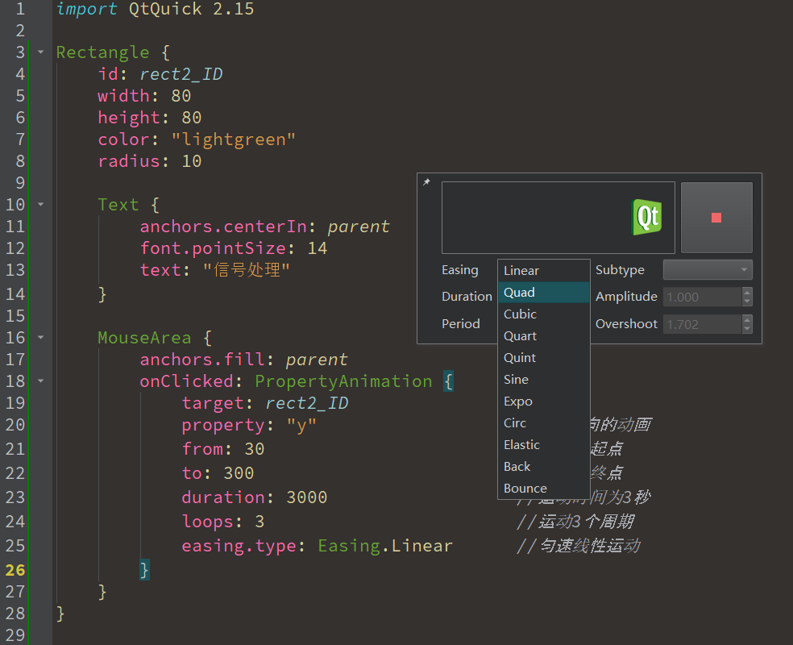
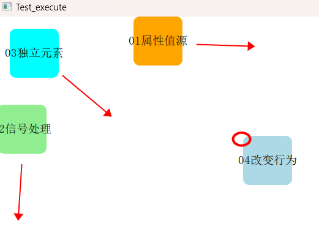
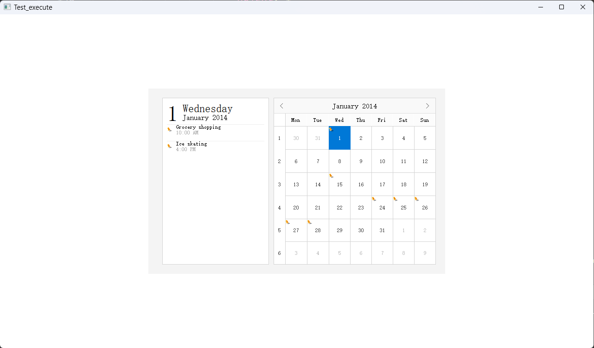

# 01_Basics

## Overview

- QML(Qt Meta Language)，自Qt4.7引入。
- Qt Quick是Qt为QML提供的一套**类库**，由QML标准类型和功能组成，包括*可视化类型、交互类型、动画类型、模型和视图、粒子系统和渲染效果等*。
- 每个**QML文档**都由*import*和*对象声明*构成。


## QML Syntax

Profile：

- QML是一种描述用户界面的**声明式**语言。
- 子元素从父元素上继承了坐标系统，**它的x,y坐标总是相对应于它的父元素坐标系统**。
- 每一个QML文件都需要一个根元素，就像HTML一样。
- 一个元素使用它的类型声明，然后使用{}进行包含。
- 元素拥有属性，他们按照`name:value`的格式来赋值。
- 任何在QML文档中的元素都可以使用它们的id进行访问（`id`是一个任意的标识符）。
- 元素可以嵌套，这意味着一个父元素可以拥有多个子元素。子元素可以通过访问`parent`关键字来访问它们的父元素。*有一个比较好的方法是命名你的根元素对象id为root（id:root），这样就不用去思考你的QML文档中的根元素应该用什么方式命名了。*

Properties：

- 对象和属性：

  - 每个QML文档（文件）**有且只有一个**跟对象。

  - 对象由类型它们的类型指定，以**大写**字母开头，后面跟一对大括号。

  - 对象的属性在括号中，以**键值对**的形式出现。

  - 一个属性能够设置一个值，这个值依赖于它的类型。如果没有对一个属性赋值，那么它将会被初始化为一个默认值。（具体看帮助文档）。

  - QML允许将多个属性写在一行，但是它们之间必须用**分号**隔开。

  - ```js
    {
        width: 300
        height: 300
    }
    //或者
    {
        width: 300; height: 300
    }
    ```

  - 一个属性能够依赖一个或多个其它的属性，这种操作称作**属性绑定**。当它依赖的属性改变时，它的值也会更新。

  - 使用`property`修饰符自定义属性，然后跟上类型、名字和可选择的初始化值。如果没有初始值将会给定一个系统初始值作为初始值。**注意如果属性名与已定义的默认属性名不重复，使用default关键字你可以将一个属性定义为默认属性。这在你添加子元素时用得着，如果他们是可视化的元素，子元素会自动的添加默认属性的子类型链表（children property list）**。

- 对象标识符：

  - `id`是一个非常特殊的属性值，它可以作为一个标识符在当前文档内引用对应的元素。
  - `id`不是一个字符串，而是一个标识符和QML语法的一部分。
  - `id`在一个QML文档中是唯一的，并且不能被设置为其它值，也无法被查询（像C++里的指针）。
  - `id`值必须使用**小写字母或下划线开头**，并且**不能使用除字母、数字和下划线以外的字符**。

- 属性别名：`alias`

  - 作用：属性别名允许外部对象（其他QML文件）直接修改和访问本QML文档中的子对象。

  - 它可以将内部嵌套的QML元素的属性导出到外面使用；**注意**，**只有根级目录的属性才能够被其它文件的组件访问**。

  - 例如：

    ```js
    //other.qml
    Xxx {
        ...
        mouseArea.OnClicked: {
            console.log("external mouseArea clicked!");
        }
        ...
    }
        
    //internal.qml
    Rectangle {
        property alias mouseArea: mouseArea //MouseArea的属性别名
        ...
        MouseArea {
            id: mouseArea
            ...
        }
    }
    ```

  - 如果你想使用命令行的方式构建Qt5，你首先需要拷贝一个代码库并构建它：

  - ```bash
    git clone git://gitorious.org/qt/qt5.git
    cd qt5
    ./init-repository
    ./configure -prefix $PWD/qtbase -opensource
    make -j4
    ```

  - 如果你想测试你的编译，只需简单的启动`qtbase/bin/qmlscene`并且选择一个QtQuick的例子运行：

  - ```bash
    qtbase/bin/qmlscene xxxx.qml
    ```

- 关于属性其他的点：

  - 一些属性是元素自身的**附加属性**。这样做是为了全局的相关元素在应用程序中只出现一次（例如键盘输入：`KeyNavigation.tab: otherLabel`）。
  - 对于每个属性都可以提供一个信号操作。这个信号在属性值改变时被发送。

- 警告：**一个元素id应该只在当前文档中被引用。QML提供了动态作用域的机制，后加载的文档会覆盖之前加载文档的元素id号**

QML与JavaScript

- **QML的：`=`（属性绑定）与JavaScript的`=`（赋值）是不同的。**

- 绑定是一个**协议**，并且**存在于整个生命周期**。

- 然而JavaScript赋值（=）只会产生**一次**效果。当一个新的绑定生效或者使用JavaScript赋值给属性时，绑定的生命周期就会结束。

- 举个例子：

- ```js
  Text {
      id: text
      properry int pressedTimes: 0
      text: "xxxxxx" + pressedTimes
      //每次按下空格后都会改变显示的值（属性绑定）
      Keys.onSpacePressed: {
          pressedTimes += 1;
      }
      //按下ESC键后，再按空格也不会显示增加的次数了。
      Keys.onEscapePressed: {
          text.text = '';
      }
  }
  ```

- 类似于这个例子，最好不要使用绑定属性。可使用赋值的方式来改变属性，属性绑定会在赋值操作（`=`）后被销毁（*broken contract*）。

## Visual Elements


1. QML语言使用可视元素来描述图形化的用户界面，每个可视元素都是一个*对象*，具有**几何坐标**，在屏幕上占据一块显示区域。
2. Item（基础元素对象）是所有可视化元素的基础对象，所有其它的可视化元素都继承自Item。它自身不会有任何绘制操作，但是定义了所有可视化元素共有的属性。
3. Item（基本元素对象）通常被用来作为**其它元素的容器**使用，类似HTML语言中的div元素（div element）。

### Rectangle

- 属性`color`的默认指定颜色是来自SVG颜色的名称：[CSS Color Module Level 3 (w3.org)](https://www.w3.org/TR/css-color-3/#svg-color)
- `gradient`属性可以指明渐变：
  - `ConicalGradient`：锥形渐变；
  - `LinearGradient`：线性渐变；
  - `ConicalGradient`：原型渐变；
- 如果没有设置布局之类的，记得要指定宽和高，不然默认都是0导致矩形不可见；

### Image

- `source`属性的值可以是：
  - 远程URL；
  - 本地URL；
  - 嵌入已编译资源文件中的URL；
- 可以设置父类的`clip`属性为`true`，防止渲染的图片超出元素范围；**这对任何可视化元素都是有效的。**
- 或者设置图片的`fillMode`：`fillMode: Image.PreserveAspectCrop`；

### Text

- 这个元素会使用给出的`text`与`font`来计算**初始化**的宽度与高度，默认未给出则使用`parent`；
- `width`属性如果给出则会限制宽度，默认自动计算；
- 为了提高文本的渲染效果，可以使用`style`和`styleColor`属性来配置文字的外框效果，浮雕效果或者凹陷效果。
- `elide`属性设置文本左边，右边或者中间的省略位置。
- `wrapMode`属性：使用文字换行的方式显示所有的文本，该属性只在**明确设置了宽度**后才生效；可设置为`Text.WordWrap`只在单词边界换行。
- `textFormat`属性可设置文本格式，默认为富文本格式；Qt5.14后可支持`Text.MarkdownText`。

## Custom Components

- 可使用自定义创建的组件来重复使用；
- 使用了QML的alias（别名）的功能，它可以将内部嵌套的QML元素的属性导出到外面使用。有一点很重要，只有根级目录的属性才能够被其它文件的组件访问。
- 一般将`Item`作为root组件，防止用户改变内部的一些属性，并且可以提供出更多相关控制的API（应用程序接口）。

## Layout

### Positioner

- `Row`、`Column`、`Grid`、`Flow`都包含在QtQuick模块中；
- 流定位`Flow`：
  - 为了让一个`Flow`可以工作，**必须**指定一个宽度或者高度，可以通过属性直接设定，或者通过anchor（锚定）布局设置。
- 重复器`Repeater`：
  - 通常Repeater（重复元素）与定位器一起使用。
  - 当有一小部分的静态数据需要显示时，使用重复器是最好的方式。
  - **高级的大数据模型处理和使用动态代理的动态视图使用模型与视图（model-view）**。

### Anchor

- 可以使用`xxx.anchors.left = undefined`来解除锚点属性的定义；
- 在编程布局中，**一定要先将元素的旧锚接触，新设置的才能生效**（QtQuick 1）

## 事件处理

### 鼠标事件

- 使用`drag`设置拖拽属性；
- `mouse.button`获取按下的键，要设置`acceptedButtons`：（可以使用`|`组合设置）详细值看`Qt::MouseButtons`
  - `Qt.LeftButton`：鼠标左键
  - `Qt.MiddleButton`：鼠标中键
  - `Qt.RightButtons`：鼠标右键
- `mouse.modifiers`获取鼠标和键盘的组合形式，然后进行判断，例如：`if (mouse.modifiers & Qt.ShiftModifier)`
- `mouse.modifiers`的值可能由多个按键进行位组合而成，详细可参考文档。

### 键盘事件

- *`focus`属性*表面当前组件是否被选中；
- `KeyNavigation`（按键向导）**附加属性**可以预先设置一个元素id绑定切换焦点的按键。
  - 它的子属性有`backtab` `down` `left` `priority` `right` `tab` `up`。
  - 可以使用这些来设置焦点转移。
  - 例如：`KeyNavigation.tab: xxx_ID`表示在这个控件中按下`Tab`键后焦点转移到id为`xxx_ID`的控件上。
- 使用`Keys`的附加属性可以处理按下按键之后的事件，例如：`Keys.onLeftPressed: xxx_ID.y += 10`表示按下方向键后移动位置。

### 输入控件与焦点

- `TextInput`：
  - QML本身提供的元素，只有光标和文本内容，无边框。
  - 这个元素支持使用正则表达式验证器来限制输入和输入掩码的模式设置。
  - `validator`、`inputMask`、`echoMode`。
- `TextEdit`：
  - 和`TextInput`类似，多行的文本编辑组件。
  - 它不再支持文本输入的限制，但是提供了已绘制文本的大小查询（`paintedHeight`，`paintedWidth`）。

#### FocusScope

- 可以将自定义的组件置于`FocusScope`中，**因为这样能有效地控制焦点**。
- 假如控件中有很多子元素，在程序运行时，父元素不会主动将焦点转移给子元素；为了解决这一问题，QML专门提供了`FocusScope`，**它在接收到焦点时，会将焦点交给最后一个设置了`focus: true`的子对象**。
- 这样子元素需要焦点时，则不会被父元素所夺取。
- 例如Row中有Text和Rectangle，Rectangle为输入元素`TextInput`的边框。

## QML导入JS函数

- 将js文件添加到qt的资源文件后，在要使用QML文件中导入：
- `import "myscript.js" as Xxxxx`
- 然后使用：`Xxxxx.xx();`


------


# 02_Animation

> 所有的动画元素都继承自`Animation`元素
>
> **<mark>不要过度的使用动画</mark>。用户界面动画的设计应该尽量小心，动画是让界面更加生动而不是充满整个界面。眼睛对于移动的东西非常敏感，很容易干扰用户的使用。**

## QML动画元素

### PropertyAnimation

- 属性动画元素可以通过不同的方式来使用，取决于应用场景：（`In a Transition`、`In a Behavior`、`As a property value source`、`In a signal handler`、`Standalone`）
  - **作为属性值的来源**：可以立即为一个指定的属性使用动画；
  - **在信号处理器中创建**：当接收到一个信号时触发动画；
  - **作为独立动画元素**：像一个普通的QML对象一样，不需要绑定到任何特定的对象和属性；
  - **在属性值改变的行为中创建**：当一个属性改变时触发动画；
  
- 例子①如下：

  - ```js
     PropertyAnimation on x {
        from: 50                        //动画的起点
        to: 500                         //动画的终点
        duration: 30000                 //运动时间为30秒
        loops: Animation.Infinite       //无限循环
        easing.type: Easing.OutBounce   //反弹
    }
    ```

  - 这里在 某个`Rectangle`的`x`属性上 应用了`PropertyAnimation`，来使它从起始值50在30000毫秒中使用动画变化到500；

  - `Rectangle`一旦加载完成就会**立即**开启该动画；

  - `loops`属性设定为`Animation.Infinite`表明该动画是无限循环的；

  - 对于任何基于`PropertyAnimation`的动画**都**可以通过设置`easing`属性来控制在属性值动画中使用的**缓和曲线**；

    - 缓和曲线可以影响这些属性值的动画效果，提供**反弹**、**加速**、减速等视觉效果；

  - 这里通过使用`Easing.OutBounce`创建了一个动画达到目标值时的反弹效果；

- 例子②如下：

  - ```js
    MouseArea {
        anchors.fill: parent
        //可以在一个信号处理器中创建一个动画，并在接收到信号时触发这个动画
        //
        //
        onClicked: PropertyAnimation {
            target: rect2_ID                //动画应用的目标（目标对象）
            property: y                   //y轴方向的动画
            from: 30                        //动画的起点
            to: 300                         //动画的终点
            duration: 3000                  //运动时间为3秒
            loops: 3                        //运动3个周期
            easing.type: Easing.Linear      //匀速线性运动
        }
    }
    ```

  - 可以在一个信号处理器中创建一个动画，并在**接收到信号时触发**这个动画；

  - 当`MouseArea`被单击时触发，在3000毫秒内使用动画将某个控件的y坐标属性由30改为300，并往复运动3次；

  - 因为该动画没有绑定到一个**特定的对象或属性**，所以必须**指定`target`和`property`（`properties`）**；

  - 

- 例子③如下：

  - ```js
    PropertyAnimation {
        id: animation_ID
        target: rect3_ID                //动画应用的目标（目标对象）
        properties: "x,y"               //同时在x、y轴两个方向上运动
        duration: 5000                  //运动时间为5秒
        easing.type: Easing.InOutBack   //运动到半程增加过冲，然后减少
    }
    
    MouseArea {
        anchors.fill: parent
        //鼠标点击时触发动画
        onClicked: {
            animation_ID.from = 20      //设置起点
            animation_ID.to = 200       //设置终点
            animation_ID.running = true //开启动画
        }
    }
    ```

  - 这是一个独立的动画元素，它不会绑定到任何对象或属性上；

  - 一个独立的动画元素默认是不会运行的，需使用`running`属性或者`start()/stop()`方法来明确运行状态；

  - 独立动画元素使用在*不是对某个单一的对象属性且需要明确控制开始和停止动画*的情况下非常有用；

- 例子④如下：

  - ```js
    //定义x属性上的行为动画
    Behavior on x {
        PropertyAnimation {
            duration: 1000              //运动时间为1秒
            easing.type: Easing.InQuart //加速运动
        }
    }
    
    Behavior on y {
        PropertyAnimation {
            duration: 1000
            easing.type: Easing.InQuart
        }
    }
    ```

  - 经常在一个特定的属性值改变时要应用一个动画，在这种情况下，可以使用一个`Behavior`为一个属性改变指定一个默认动画；

  - 这里当`x`改变时（例如鼠标点击位置设置为矩形的位置），使`Rectangle`使用该动画效果移动到新的位置（鼠标点击的位置）上；

  - 行为动画时在每次响应一个属性值的变化时触发的，对这些属性的任何改变都会触发他们的动画；

  - 注意，这里`PropertyAnimation`的`from/to`是不需要指定的；

- 效果：

- 

- 可以把①理解为“使”，④理解为“被”，第一个例子是使得`x`属性（`PropertyAnimation on x`）发生变化，第四个例子是当`x`属性（`Behavior on x`）被改变时。

### 其他动画元素

> 其他的动画元素大多继承自`PropertyAnimation`，其中主要有：
>
> - `NumberAnimation`：为实数和整数等数值类属性提供了更高效的实现；
> - `ColorAnimation`：为颜色动画提供特定支持；
> - `RotationAnimation`：为旋转动画提供特定支持；
> - `Vector3dAnimation`：为矢量3D提供更高效的支持；

- 除了上面这些基本和通常使用的动画元素，QtQuick还提供了一切特殊场景下使用的动画：

  - `PauseAnimation`（停止动画）- 运行暂停一个动画
- `SequentialAnimation`（顺序动画）- 允许动画有序播放
  - `ParallelAnimation`（并行动画）- 允许动画同时播放
- `AnchorAnimation`（锚定动画）- 使用锚定改变播放的动画
  - `ParentAnimation`（父元素动画）- 使用父对象改变播放的动画
- `SmotthedAnimation`（平滑动画）- 跟踪一个平滑值播放的动画
  - `SpringAnimation`（弹簧动画）- 跟踪一个弹簧变换的值播放的动画
- `PathAnimation`（路径动画）- 跟踪一个元素对象的路径的动画
  - `Vector3dAnimation`（3D容器动画）- 使用QVector3d值改变播放的动画

- 当使用更加复杂的动画时，我们可能需要在播放一个动画时中改变一个属性或者运行一个脚本。对于这个问题，QtQuick提供了一个动作元素：

  - `PropertyAction`（属性动作）- 在播放动画时改变属性
  - `ScriptAction`（脚本动作）- 在播放动画时运行脚本
  
- 例子：简单的从一个矩形滚动变成一个圆形

- ```js
  Rectangle {
      id: transitionRect_ID
      x: 50
      y: 50
      width: 100
      height: 100
      
      //颜色值的变换
      ColorAnimation on color {
          from: "blue"
          to: "aqua"
          duration: 10000
          loops: Animation.Infinite
      }
      
      //旋转的变换
      RotationAnimation on rotation {
          from: 0
          to: 360
          duration: 10000
          loops: Animation.Infinite
          direction: RotationAnimation.Clockwise //表示顺时针
      }
      
      //数值的变换
      NumberAnimation on radius {
          from: 0
          to: 50
          duration: 10000
          loops: Animation.Infinite
      }
      
      PropertyAnimation on x {
          from: 50
          to: (rectangle_ID.width - 100) //得设最小宽度
          duration: 10000
          loops: Animation.Infinite
          easing.type: Easing.InSine
      }
  }
  ```

### Animator

> Animator有以下几种具体的动画：
>
> - `OpacityAnimator`：作用于**透明**的动画；
> - `RotationAnimator`：作用于**旋转角度**的动画；
> - `ScaleAnimator`：作用于**缩放**的动画；
> - `UniformAnimator`：作用于着色器uniform变量的动画；
> - `XAnimator`：作用于**水平**方向的动画；
> - `YAnimator`：作用于**垂直**方向的动画；

- `Animator`是一类特殊的动画元素，自Qt5.2引入，比传统的基于对象和属性的`Animation`元素给用户的视觉体验更佳；

- 它能直接作用于Qt Quick的场景图形（*scene graph*），这使得基于`Animator`元素的动画即使在UI界面**线程阻塞**的情况下也能通过**场景图形系统的渲染线程**来工作；

- 例子：

- ```js
  Rectangle {
      id: rect_ID
      width: 200
      height: 200
      color: "cadetblue"
  
      //XAnimator类型是元素在水平方向上移动的动画
      XAnimator on x {
          from: 10;
          to: 600;
          duration: 7000
          loops: Animator.Infinite
      }
  
      //同上，垂直方向的动画
      YAnimator{
          target: rect_ID
          from: 10;
          to: 600;
          duration: 7000
          loops: Animator.Infinite
      }
  
      //ScaleAnimator改变一个元素的尺寸因子，产生使元素尺寸缩放的动画
      ScaleAnimator on scale {
          from: 0.2;
          to: 1;
          duration: 7000
          loops: Animator.Infinite
      }
  
      //旋转
      RotationAnimator on rotation {
          from: 0;
          to: 360;
          duration:7000
          loops: Animator.Infinite
      }
  
      //透明度
      OpacityAnimator on opacity {
          from: 0.2;
          to: 1;
          duration: 7000
          loops: Animator.Infinite
      }
  }
  ```


## Fluid UI

> 具有动画效果的流UI界面——Fluid UIs
>
> - 界面上的组件能以动画的形态做出连续变化，而不是突然显示、隐藏。
> - Qt Quick 提供了多种创建动画流UI界面的方法，主要有：
>   - 使用状态切换机制
>   - 设计组合动画

### 状态和切换

- 状态：
  - Qt Quick允许用户在`State`对象中声明各种不同的UI状态。
  - 状态对象中有个属性改变(`PropertyChanges`)的元素，不同的UI状态可通过该元素设置**状态切换**时基本属性的目标值，使用户组织UI界面逻辑。

- 切换：
  - 切换是一种与元素相关联的对象，它定义了当该元素的状态发生改变时，其属性将以怎样的动画方式呈现。

- `states`属性是`Item`元素的属性，同样也有获得当前状态的属性`state`：
  - states : list<State>
  - state : string（如果没有在状态列表中设置该元素的状态，则默认返回空串）

- 举个例子：

- ```js
  Text {
      id: text_ID
      color: "grey"                       //初始文字显示为灰色
      font.family: "Source Code Pro"		//字体
      font.pointSize: 14                  //初始字号为12
      font.bold: true                     //加粗
      //该元素的所有状态列表
      states: [
          State {
              name: "highlight"
              when: mouseArea_ID.pressed
  
              PropertyChanges {
                  target: stext
                  color: "red"
                  font.pointSize: 25
                  //以艺术字呈现
                  style: Text.Raised
                  styleColor: "red"
              }
          }
      ]
      transitions: [
          Transition {
              PropertyAnimation {
                  duration: 1000
              }
          }
      ]
  
      MouseArea {                         //能接受鼠标单击
          id: mouseArea_ID
          anchors.fill: parent
      }
  }
  ```

- `states`属性包含所有的状态列表，如果只有一个状态，可以省略`[ ]`；

- `State`元素：

  - 可以指定被改变的属性：`[default] changes : list<Change>`；
  - 也可以在里面创建`PropertyChanges`元素；
  - 也可以修改其他对象的属性（不仅仅是拥有该状态的对象）；
  - 除此之外，`State`还能：
    - 使用`StateChangeScript`运行一些脚本；
    - 使用`PropertyChanges`为一个对象**重写**现有的信号处理；
    - 使用`PropertyChanges`为一个元素**重定义**一个父元素；
    - 使用`AnchorChanges`修改锚点的值；

- `name`属性：

  - 其中`name`属性可以指定状态的名称，每一个状态对象都有一个在**本元素**中**唯一**的名称，默认为空串；

  - 一个元素可以将其`state`属性设为**空串**来明确的将其状态设置为默认状态（初始化元素的属性值）；

  - 要改变一个元素的当前状态，可以将其`state`属性设置为要改变的状态名，例如：

  - ```js
    Rectangle {
        id: myRect
        width: 100; height: 100
        color: "black"
        
        MouseArea {
            id: mouseArea
            anchors.fill: parent
            onClicked: myRect.state == 'clicked' ? myRect.state = "" : myRect.state = 'clicked';
        }
        
        states: [
            State {
                name: "clicked"
                PropertyChanges { target: myRect; color: "red" }
            }
        ]
    }
    ```

- `when`属性：

  - 该属性设置了什么时候进入这个状态，类型是`bool`型；
  - 所有的QML可视元素都有一个默认状态，在默认状态下包含了该元素所有的初始化属性值；
  - 元素可以不设置`when`属性，但是要明确什么时候变为该状态；

- `Transition`元素：

  - 元素在不同状态间改变时使用`transition`属性来实现**动画效果**；
  - 注意，单个`Transition`不需要设置动画中的`from`和`to`属性，因为在状态改变的开始之前和结束之后会自动设置；`from`属性会被设置为当前值，`to`属性会设为`PropertyChanges`中的值。

### 组合动画

> 单一的动画可以组合成一个复合动画，想要运行复杂的动画，可以在一个动画组中进行设计。

- `ParallelAnimation`：在这个动画组中的动画会并行（同时）运行；
- `SequentialAnimation`：在这个动画组的动画会依次运行（串行）；
- 注意，一旦独立的动画被放入这两个动画组中，就不能在**单独**开始或停止，串行和并行动画都必须作为一个组进行开始和停止；

举个简单的例子：

- ```js
  Rectangle { //水平往返移动的矩形背景区
      id: rectangle_ID
      width: 500
      height: 600
      color: "grey"
      clip: true //使得矩形内部的元素不超过矩形边框
  
      Image { //图像元素显示照片
          id: image_ID
          source: "qrc:/Pictures/Used_Images/Pictures/01_QML.png"
          //照片沿垂直中线下落
          anchors.horizontalCenter: parent.horizontalCenter
          y: 0            //初始时位于顶端
          scale: 0.1      //大小为原尺寸的1/10
          opacity: 0      //初始透明度为0（不可见）
          rotation: 45    //初始放置的角度
      }
  
      MouseArea {
          anchors.fill: parent
          onClicked: {
              rectangleSequentialAnimation_ID.running = true  //开启水平方向（矩形往返）动画
              imageSequentialAnimation_ID.running = true      //开启垂直方向（照片掉落）动画
          }
      }
  
      //矩形的动画组
      SequentialAnimation on x {
          id: rectangleSequentialAnimation_ID
          running: false //初始时关闭动画
          loops: Animation.Infinite //设置动画组一直运行
  
          //实现往返运动
          NumberAnimation {
              from: 0
              to: parent.parent.width - rectangle_ID.width
              duration: 8000
              easing.type: Easing.InOutQuad
          }
          NumberAnimation {
              // from: parent.parent.width - rectangle_ID.width
              to: 0
              duration: 8000
              easing.type: Easing.InOutQuad
          }
          //在动画中间进行暂停
          PauseAnimation {
              duration: 1000
          }
      }
  
      //图像的动画组
      SequentialAnimation {
          id: imageSequentialAnimation_ID
          loops: Animation.Infinite //设置动画组一直运行
  
          ParallelAnimation {
              ScaleAnimator { //缩放动画
                  target: image_ID
                  to: 1
                  duration: 2000
              }
              OpacityAnimator { //透明度动画
                  target: image_ID
                  to: 1
                  duration: 3000
              }
              RotationAnimator { //旋转动画
                  target: image_ID
                  to: 360
                  duration: 2000
              }
              NumberAnimation {
                  target: image_ID
                  property: "y"
                  to: rectangle_ID.height - image_ID.height //运动到矩形区的底部
                  easing.type: Easing.OutBounce //为造成照片落地后又“弹起”的效果
                  duration: 5000
              }
          }
  
          PauseAnimation {
              duration: 2000
          }
  
          ParallelAnimation { //重回初始状态
              NumberAnimation {
                  target: image_ID
                  property: "y"
                  to: 0
                  easing.type: Easing.OutQuad
                  duration: 1000
              }
              OpacityAnimator {
                  target: image_ID
                  to: 0
                  duration: 1000
              }
          }
      }
  }
  ```

展示图：

- 

解释：

- 矩形的动画组`SequentialAnimation on x`，这个串行的动画作为**属性值源**应用在了矩形的`x`属性上，不需要指定目标和属性，组内的动画也都会应用到矩形的`x`属性上；
- 图像的动画组`SequentialAnimation`没有定义到任何属性上，所以组中的各个子动画都需要明确目标（`target`）和属性（`property`）；
- 动画组也可以嵌套，例如图像组中有三个子组；

### 白天黑夜开关动画

> 这里实现一个之前很火的白天黑夜切换的开关，使用动画和基本元素实现。
>
> 一个比较有意思的图：
>
> 

- 效果如下：

- 

- 

- 源码：

  - 使用：

  - ```js
    //网红的白天黑夜切换开关
    Rectangle {
        color: "#abcce1"
        anchors.fill: parent
        Column {
            anchors.centerIn: parent
            
            SwitchDayAndNight {
                switchWidth_i: 200 //根据宽度自动设定开关样式
                animationDuration_i: 500
            }
            SwitchDayAndNight {
                switchWidth_i: 600 //根据宽度自动设定开关样式
                animationDuration_i: 1000
            }
        }
    }
    ```

  - 具体动画：

  - ```js
    //切换动画
    ParallelAnimation {
        id: cloudsAndSunMove_ID
        alwaysRunToEnd: true
        loops: 1
        running: false
        
        NumberAnimation {
            target: lightRect_ID //太阳和光晕移动
            property: "x"
            to: switchWidth_i - lightRect_ID.x - lightRect_ID.width
            duration: animationDuration_i
            easing.type: Easing.InOutCubic
        }
        NumberAnimation {
            target: moonRect_ID //月亮移动
            property: "x"
            to: lightRect_ID.width + dropShadow_light_ID.radius * 2 - moonRect_ID.x
            duration: animationDuration_i
            easing.type: Easing.InOutCubic
        }
        NumberAnimation {
            target: distantCloudsItem_ID //远处云层下移
            property: "y"
            to: rootItem_ID.height - distantCloudsItem_ID.y
            duration: animationDuration_i
            easing.type: Easing.InOutCubic
        }
        NumberAnimation {
            target: cloudsItem_ID //云层下移
            property: "y"
            to: rootItem_ID.height - cloudsItem_ID.y
            duration: animationDuration_i
            easing.type: Easing.InOutCubic
        }
        NumberAnimation {
            target: starsItem_ID //星星下移
            property: "y"
            to: -starsItem_ID.y - rootItem_ID.height
            duration: animationDuration_i
            easing.type: Easing.InOutCubic
        }
    }
    
    //星星动画
    SequentialAnimation {
        id: starsShiningAnimation_ID
        loops: Animation.Infinite
        running: (0 === switchState_i)
        
        PropertyAnimation {
            target: star9_ID
            property: "scale"
            from: 0.1
            to: 1
            duration: 400
        }
        PropertyAnimation {
            target: star6_ID
            property: "scale"
            from: 0.1
            to: 1
            duration: 400
        }
        PropertyAnimation {
            target: star5_ID
            property: "scale"
            from: 0.1
            to: 1
            duration: 400
        }
        PropertyAnimation {
            target: star2_ID
            property: "scale"
            from: 0.1
            to: 1
            duration: 400
        }
        PauseAnimation {
            duration: 4000
        }
    }
    
    //宇航员动画
    SequentialAnimation {
        id: astronautAnimation_ID
        loops: Animation.Infinite
        running: (0 === switchState_i)
        
        PauseAnimation {
            duration: 2000
        }
        ParallelAnimation {
            NumberAnimation {
                target: astronaut_ID
                property: "x"
                duration: animationDuration_i * 8
                from: -astronaut_ID.width
                to: switchWidth_i / 5 * 3
                easing.type: Easing.OutInBack
            }
            NumberAnimation {
                target: astronaut_ID
                property: "y"
                duration: animationDuration_i * 16
                from: rootItem_ID.height + astronaut_ID.height
                to: -astronaut_ID.height
                easing.type: Easing.OutInBack
            }
            RotationAnimation {
                target: astronaut_ID
                from: 0
                to: 360
                duration: animationDuration_i * 16
            }
        }
        PauseAnimation {
            duration: 4000
        }
    }
    
    //飞机动画
    SequentialAnimation {
        id: planeAnimation_ID
        loops: Animation.Infinite
        running: (1 === switchState_i)
        
        PauseAnimation {
            duration: 2000
        }
        ParallelAnimation {
            //注意如果使用Animator，改变动画状态running为false后再调用complete()不生效
            NumberAnimation {
                target: plane_ID
                property: "x"
                duration: animationDuration_i * 8
                from: switchWidth_i
                to: -plane_ID.width
                easing.type: Easing.InOutCubic
            }
            NumberAnimation {
                target: plane_ID
                property: "y"
                duration: animationDuration_i * 8
                from: rootItem_ID.height / 3 * 2
                to: 0
                easing.type: Easing.InOutCubic
            }
        }
        PauseAnimation {
            duration: 3000
        }
    }
    ```

- 总结：

  - 如果把矩形设置半径，然后需要设置`clip`属性，在这种情况下会出现内部组件超出范围的情况，需要设置遮盖或着色器；
  - 设置遮盖后内外阴影会有一些问题，可以自己写；
  - 因为`Animator`是独立用GPU渲染，阻塞也不会影响运行，但是在需要自定义动画启停且频率较高时还是不要用了，容易有问题；

## 图像特效

### 3D旋转效果

- 使用`transform`属性来进行变换特效；
  - 需要指定一个`Transform`元素列表，`Transform`元素是抽象基类元素，没有实例化，所以`QtQuick 2.15`提供**四个**可用的实体元素类型：
    - `Rotation`：提供`Item`**旋转**变换效果；
    - `Scale`：提供**缩放**效果；
    - `Translate`：提供**平移**效果；
    - `Matrix4x4`：提供矩阵变换；
  - 每个实体元素都有专门的属性来进行更加高级的设置，其中`Rotation`提供了**坐标轴**和**原点**属性：
    - `axis.x`、`axis.y`、`axis.z`代表x、y、z轴；
      - 数值`>0`表示在哪个方向顺时针旋转，`<0`表示逆时针；
    - 原点由`origin.x`和`origin.y`指定；
- `AnimateImage`是`Image`元素的扩展，可以用来播放包含一系列帧的图像动画，例如`gif`文件；
  - 可以使用`currentFrame`属性获得当前帧，使用`frameCount`属性获得动画总长度；
  - 还可以更改`playing`和`paused`属性的值来手动开始、暂停、停止动画；

- *举个例子：*

```js
Rectangle {
    id: rootRect_ID
    width: animatedImage_ID.width
    height: animatedImage_ID.height
    transform: Rotation {
        //设置图像原点的位置
        origin.x: animatedImage_ID.width / 2
        origin.y: animatedImage_ID.height / 2
        axis {
            x: 1
            y: 1
            z: 1
        }
        //定义Rotation元素中属性angle（角度）上的动画
        NumberAnimation on angle {
            from: 0
            to: 360
            duration: 10000
            loops: Animation.Infinite
        }
    }

    AnimatedImage {
        id: animatedImage_ID
        source: "qrc:/Pictures/Used_Images/Pictures/01_QML.png"
    }
}
```

- 效果图：

- 

### QtGraphicalEffects图形特效

- QML的`QtGraphicalEffects`库提供了**图形特效**元素类型，其中有实现*图像由彩色变黑白、加阴影、模糊处理、对比度、亮度*等特效；
- 使用`QtGraphicalEffects`的`BrightnessContrast`特效元素，可以设置源元素的**亮度**和**对比度**；
  - `source`属性一般是一个`Image`或`AnimatedImage`；
  - `brightness`属性设置源元素的亮度，由最暗到最亮对应的取值范围是：` -1.0 ~ 1.0`，默认为`0.0`
  - `contrast`属性设置源元素的对比度，取值范围为：`-1.0 ~ 1.0`，其中，`-1.0 ~ 0.0`的对比度是线性增加，`0.0 ~ 1.0`的对比度是非线性增加的，越接近`1.0`增加曲线越陡峭；
- *BrightnessContrast effect is available when running with OpenGL*


> `QtGraphicalEffects`的其他元素类型

- `QtGraphicalEffects`的其他元素，可参考PhotoShop中对图像的处理：
  - `Blend`：使用混合模式合并两个源项；
  - `coloroverlayer`：通过应用叠加颜色来改变源项的颜色；
  - `Colorize`：类似于将彩色玻璃放在灰度图像上所发生的效果。`Colorize`使用色调、饱和度和明度(HSL)色彩空间；
  - `Desaturate`：降低颜色的饱和度，其`desaturation`属性越大饱和度越小；
  - `GammaAdjust`：调节Gamma曲线值改变亮度；
  - `HueSaturation`：更改HSL颜色空间中的源元素的颜色；
  - `LevelAdjust`：调整RGBA色彩空间中的色彩级别；
  - `ConicalGradient`：锥形渐变；
  - `LinearGradient`：线性渐变；
  - `RadialGradient`：径向渐变；
  - `Displace`：根据给定的位移图，移动源元素；
  - `DropShadow`：在源元素后面生成一个柔和的阴影；
  - `InnerShadow`：在源元素内部产生一个彩色和模糊的阴影；
  - `FastBlur`：快速模糊效果；
  - `GaussianBlur`：高斯模糊效果；
  - `MaskedBlur`：通过给定源来应用不同强度的模糊；
  - `RecursiveBlur`：反复强烈模糊；
  - `DirectionalBlur`：对指定方向应用模糊效果；
  - `RadialBlur`：在源元素中心点周围的圆形方向上应用方向模糊；
  - `ZoomBlur`：对源元素中心点应用方向模糊效果；
  - `Glow`：在源元素周围产生类似光晕的辉光；
  - `RectangularGlow`：产生一个给人 ”源元素是发光的感觉” 的模糊和彩色矩形；
  - `OpacityMask`：使用另一个源来遮盖源元素；
  - `ThresholdMask`：使用另一个源来遮盖源元素并应用阈值调整源元素；


> 举个例子：

- ```js
  Rectangle {
      width: animatedImage1_ID.width + animatedImage2_ID.width
      height: Math.max(animatedImage1_ID.height, animatedImage2_ID.height)
  
      Row {
          Item {
              width: animatedImage1_ID.width
              height: animatedImage1_ID.height
              AnimatedImage {
                  id: animatedImage1_ID
                  source: "qrc:/Pictures/Used_Images/GIF/countryside_512x512.gif"
              }
              LevelAdjust {
                  id: rgbaLevelAdjust_ID
                  anchors.fill: animatedImage1_ID
                  source: animatedImage1_ID
              }
          }
  
          Item {
              width: animatedImage2_ID.width
              height: animatedImage2_ID.height
              AnimatedImage {
                  id: animatedImage2_ID
                  source: "qrc:/Pictures/Used_Images/GIF/countryside_512x512.gif"
              }
              BrightnessContrast {
                  id: brightnessContrast_ID
                  anchors.fill: animatedImage2_ID
                  source: animatedImage2_ID
              }
          }
      }
  
      ParallelAnimation {
          id: animation_ID
          running: false
          loops: Animation.Infinite
  
          SequentialAnimation {
              NumberAnimation {
                  target: brightnessContrast_ID
                  property: "brightness"
                  to: -0.5
                  duration: 3000
              }
              NumberAnimation {
                  target: brightnessContrast_ID
                  property: "contrast"
                  to: 0.25
                  duration: 3000
              }
          }
  
          ParallelAnimation {
              PropertyAnimation {
                  target: rgbaLevelAdjust_ID
                  property: "minimumOutput"
                  to: "#00ffffff"
                  duration: 3000
              }
              PropertyAnimation {
                  target: rgbaLevelAdjust_ID
                  property: "maximumOutput"
                  to: "#ff000000"
                  duration: 3000
              }
          }
      }
  
      MouseArea {
          anchors.fill: parent
          onClicked: {
              animation_ID.running = true;
          }
      }
  }
  ```

- 鼠标单击后，左边更改为反色，右边先变暗然后对比度增强；

- 效果图：

- 


------


# 03_QuickControls 1

> `Qt Quick Controls`从<mark>Qt5.1</mark>开始引入，且从<mark>Qt5.12</mark>开始分开成为独立的`Qt Quick Controls 1`

## Controls 1 组件

- `ApplicationWindow`

  - 组件类属性：`menuBar`、`toolBar`、`statusBar`、`style`；
  - 一个完整的主应用窗口包含菜单栏、工具栏、内容显示区、状态栏等UI组件；

- `style`样式属性：

  - 自Qt5.1起，引入了一个`Qt Quick Controls Styles`的子模块，它几乎为每个Qt Quick控件都提供了一个样式类，在`Qt Quick Controls 2`是没有的；

  - 凡是对应有样式元素的Qt Quick控件都可以由用户自定义其外观，定制控件的样式有以下两种方法：

    1. 使用控件的样式属性：`style`

       - 如果某个控件`Xxxx`有`style`属性，则对应的样式属性元素为`XxxxStyle`。例如：

       - ```js
         import QtQuick.Controls.Styles 1.4
         
         ApplicationWindow {
             style: ApplicationWindowStyle {
                 background: BorderImage {
                     source: "background.png"
                     border { left: 20; top: 20; right: 20; bottom: 20 }
                 }
             }
         }
         ```

    2. 定义样式代理：

       - 样式代理是一种由用户定义的属性类组件。例如：
    
       - ```js
         property Component xxxXXX: XxxxStyle {
             //自定义样式
         }
         ```

       - `xxxXXX`为样式代理名称，这样定义后，就可以在控件代码中直接引用名称来指定控件的样式了：
    
       - ```js
         Xxxx{
             ...
             style: xxxXXX //通过代理名指定样式
             ...
         }
         ```
    
       - 这样的好处是：如果有多个**相同样式类型**的控件，那么只需要在样式代理中定义一次多用，提高代码的复用性；注意**样式类型**必须匹配；

- `BusyIndicator`

  - 忙指示器，自Qt5.2引入，当应用程序正在载入某些内容或者UI被阻塞等待某个资源变为可用时，可以使用`BusyIndicator`来提示用户耐心等待，例如网络图片加载：

  - ```js
     BusyIndicator {
         running: image.status === Image.Loading
     }
    ```

- `validator`筛选器属性：

  - 某些输入控件（如`ComboBox、SpinBox、TextField、TextInput`）可以设置条件筛选器` IntValidator`、`DoubleValidator`、` RegExpValidator`、`RegularExpressionValidator`，只有当用户的输入符合要求时才能被文本框接受。

- `Calendar`

  - 日历控件是自Qt5.3才引入的，可视化日历组件，可供用户选择日期，`minimumDate/maximunDate`属性设定了可选择的日期范围；
  - `Calendar`支持最早从*公元后1年1月1日~公元后175759年10月25日*；

- Qt Quick 对话框。Qt Quick 对话框是从Qt5.1开始逐步增加的模块，目前有五个：

  - `Dialog`：封装了标准按钮的通用对话框；
    - 对话框底部有一组标准按钮，每一个按钮都有一个**角色(ButtonRole)**，这个角色**决定了**它被按下时将发出**何种信号**；
    - 可以通过设置对话框的`standardButton`属性来控制所要使用的按钮；
    - 例如：`standardButton: StandardButton.Ok | StandardButton.Cancel`；
    - 对应的角色则是：`AcceptRole`和`RejectRole`；则对应的信号为：`accepted()`和`rejected()`；对应的槽函数为：`onAccepted()`和`onRejected()`；
    - 对话框都有一个<mark>`modality`</mark>属性，设定该对话框的模态属性（简单理解为阻塞其他窗口与否，如何阻塞），值为`Qt::WindowModality`枚举类型；详细含义如下：
      - `Qt.NonModal`：
        - 该窗口不是模态窗口且**不会阻塞**其他窗口。
        - 在对话框中的体现就是，弹出对话框后也可以在其他窗口上进行操作，不影响其他窗口交互；
      - `Qt.WindowModal`：
        - 单一窗口层次结构的模态，阻塞其**父窗口**、**所有祖父窗口**、所有父窗口的兄弟窗口、**所有祖父窗口的兄弟窗口**；
        - 在对话框中的体现就是，弹出对话框后其他父、祖父等窗口不能操作；
      - `Qt.ApplicationModal`：
        - 该窗口对应用程序来说是模态的，并阻塞**所有窗口**；
        - 对于对话框，弹出对话框后所有该应用程序的窗口都被阻塞不能操作了；
  - `FileDialog`：供用户从本地文件系统中选择文件的对话框；
    - 文件选择对话框有个*文件名过滤器*属性：`nameFilters`，由字符串列表组成，可以包含`?`和`*`通配符，并对每种过滤器提供一个文字描述，例如：
    - `nameFilters: [ "Image files (*.jpg *.png)", "All files (*)" ]`
  - `FontDialog`：供用户选择字体的对话框；
  - `ColorDial`：选择颜色的对话框；
  - `MessageDialog`：显示消息弹出的对话框；

## Quick.Controls 1.4 新增组件

> import QtQuick.Extras 1.4 //扩展库

- `CircularGauge`

  - 一个类似仪表盘的圆形控件，用指针指示刻度；

  - `CircularGauge`有个`CircularGaugeStyle`来控制控件样式；

  - 举个例子：

    ```js
    CircularGauge {
        value: accelerating ? maximumValue : 0
    
        property bool accelerating: false
    
        Keys.onSpacePressed: {
            accelerating = true //表示加速状态
        }
    
        Keys.onReleased: (event)=> {
            if (event.key === Qt.Key_Space) {
                accelerating = false;
                event.accepted = true; //以防止事件沿项目层次结构向上传播
            }
        }
    
        Component.onCompleted: forceActiveFocus()
    
        Behavior on value {
            NumberAnimation {
                duration: 1000
                easing.type: Easing.Linear
            }
        }
    
        style: CircularGaugeStyle {
            id: style
    
            function degreesToRadians(degrees) {
                return degrees * (Math.PI / 180);
            }
    
            //自己绘制刻度样式
            background: Canvas {
                onPaint: {
                    var ctx = getContext("2d");
                    ctx.reset();
    
                    ctx.beginPath();
                    ctx.strokeStyle = "yellow";
                    ctx.lineWidth = outerRadius * 0.02;
    
                    ctx.arc(outerRadius, outerRadius, outerRadius - ctx.lineWidth / 2,
                            degreesToRadians(valueToAngle(80) - 90), degreesToRadians(valueToAngle(100) - 90));
                    ctx.stroke();
                }
            }
    
            //大刻度
            tickmark: Rectangle {
                visible: styleData.value < 80 || styleData.value % 10 == 0
                implicitWidth: outerRadius * 0.02
                antialiasing: true
                implicitHeight: outerRadius * 0.06
                color: styleData.value >= 80 ? "#e34c22" : "cadetblue"
            }
    
            //小刻度
            minorTickmark: Rectangle {
                visible: styleData.value < 80
                implicitWidth: outerRadius * 0.01
                antialiasing: true
                implicitHeight: outerRadius * 0.03
                color: "cadetblue"
            }
    
            //刻度下的文字
            tickmarkLabel:  Text {
                font.pixelSize: Math.max(6, outerRadius * 0.1)
                text: styleData.value
                color: styleData.value >= 80 ? "#e34c22" : "cadetblue"
                antialiasing: true
            }
    
            //指针
            needle: Rectangle {
                y: outerRadius * 0.15
                implicitWidth: outerRadius * 0.03
                implicitHeight: outerRadius * 0.9
                antialiasing: true
                color: "cadetblue"
            }
    
            //中心的圆心组件
            foreground: Item {
                Rectangle {
                    width: outerRadius * 0.2
                    height: width
                    radius: width / 2
                    color: "darkslategray"
                    anchors.centerIn: parent
                }
            }
        }
    }
    ```

  - 

  - 左边是自定义样式的表盘，右边则是默认的；

- `DelayButton`
  - 
  - 延时按钮，可设置从按下开始到真正执行的时间延迟；
  - 释放按钮外圈有一层指示器，可直观的表示时间延迟；
  - 提供`DelayButtonStyle`来控制该组件样式；
- `Dial`
  - 仪表盘调节器，类似`CircularGauge`的传统风格旋钮；
  - 提供`DialStyle`来控制该组件的样式；
  - 
- `Gauge`
  - 显示一定数值范围的垂直或水平刻度器；
  - 
  - 提供`GaugeStyle`来控制该组件的样式；
- `Picture`
  - 以矢量格式显示图标图片，可以用`color`属性给图标上色；
  - 使用`source`属性指定路径或`QPicture`数据；例如：`source :  "mypicture.dat"`
  - 该组件无样式控制`Style`；
- `PieMenu`
  - 饼状菜单：
  - 
  - 提供`PieMenuStyle`自定义该控件样式；
- `StatusIndicator`
  - 状态指示器：
  - 
  - 提供`StatusIndicatorStyle`来控制该组件样式；
- `ToggleButton`
  - 两种状态的切换按钮：
  - 
  - 提供`ToggleButtonStyle`来控制该控件样式；
- `Tumbler`
  - 用上下滚动的方式选择一个值，每一列都可以上下拖动：
  - 
  - 提供`TumblerStyle`来控制该控件样式；
  - 每一列通过`TumblerColumn`组件来设置具体数值；


## OfficialExamples

### Qt Quick Controls 1 Examples

先放个`Qt Quick Controls 1`（Qt5.15.2）中所有的组件表（` import QtQuick.Controls 1.4`）：

|           类别           |       组件        |                             描述                             |
| :----------------------: | :---------------: | :----------------------------------------------------------: |
|  **Application Window**  |                   |            *用于描述应用程序的基本窗口属性的组件*            |
|                          |      Action       |     绑定到Button, ToolButton, MenuItem的抽象用户操作组件     |
|                          | ApplicationWindow |                       最顶层的应用窗口                       |
|                          |      MenuBar      |                       顶部水平的菜单栏                       |
|                          |     StatusBar     |                       窗口下面的状态栏                       |
|                          |      ToolBar      |                    包含ToolButton的工具栏                    |
| **Navigation and Views** |                   |           *允许用户在视图布局中管理或呈现其他组件*           |
|                          |    ScrollView     | 带水平/垂直滚动条的内容框架为用户显示比较大的界面元素（如图片、网页等） |
|                          |     SplitView     |               以分割条的方式横向/纵向布局视图                |
|                          |       Stack       |             为Push到StackView中的项提供附加属性              |
|                          |     StackView     |     与一组相互链接的信息页面一起使用的基于堆栈的导航模型     |
|                          | StackViewDelegate |                  提供如Pop/Push时的转换动画                  |
|                          |        Tab        |            继承自Loader且惰性加载的TabView的内容             |
|                          |      TabView      |                多个堆叠项中选择一个的视图组件                |
|                          |     TableView     |             带有滚动条、样式和标题部分的列表视图             |
|                          |  TableViewColumn  |                  TableView和TreeView中的列                   |
|                          |     TreeView      |             带有滚动条、样式和标题部分的树形视图             |
|       **Controls**       |                   |                 *用于表示或接收用户输入的项*                 |
|                          |   BusyIndicator   |                      转圈圈的繁忙指示器                      |
|                          |      Button       |                             按钮                             |
|                          |     Calendar      |                       日历/日期选择器                        |
|                          |     CheckBox      |                            复选框                            |
|                          |     ComboBox      |                            下拉框                            |
|                          |  ExclusiveGroup   |                          互斥选项组                          |
|                          |     GroupBox      |                       带标题的组框框架                       |
|                          |       Label       |                           文本标签                           |
|                          |    ProgressBar    |                            进度条                            |
|                          |    RadioButton    |                           单选按钮                           |
|                          |      Slider       |                            滑动条                            |
|                          |      SpinBox      |                          数值调整框                          |
|                          |      Switch       |                             开关                             |
|                          |     TextArea      |                          多行文本区                          |
|                          |     TextField     |                          单行文本框                          |
|                          |    ToolButton     |                           功能按钮                           |
|        **Menus**         |                   |                                                              |
|                          |       Menu        |        菜单组件，用于上下文菜单、弹出菜单、顶部菜单栏        |
|                          |     MenuItem      |                      菜单和菜单栏中的项                      |
|                          |   MenuSeparator   |                        菜单中的分割条                        |

#### 01 Calendar



- 本地数据库存储数据
- SQL语句


- `event.h`

- ```c++
  #ifndef EVENT_H
  #define EVENT_H
  
  #include <QDateTime>
  #include <QObject>
  #include <QString>
  
  class Event : public QObject
  {
      Q_OBJECT
  
      Q_PROPERTY(QString name READ name WRITE setName NOTIFY nameChanged)
      Q_PROPERTY(QDateTime startDate READ startDate WRITE setStartDate NOTIFY startDateChanged)
      Q_PROPERTY(QDateTime endDate READ endDate WRITE setEndDate NOTIFY endDateChanged)
  public:
      explicit Event(QObject *parent = 0);
  
      QString name() const;
      void setName(const QString &name);
  
      QDateTime startDate() const;
      void setStartDate(const QDateTime &startDate);
  
      QDateTime endDate() const;
      void setEndDate(const QDateTime &endDate);
  signals:
      void nameChanged(const QString &name);
      void startDateChanged(const QDateTime &startDate);
      void endDateChanged(const QDateTime &endDate);
  private:
      QString mName;
      QDateTime mStartDate;
      QDateTime mEndDate;
  };
  
  #endif
  ```

- `event.cpp`

- ```c++
  #include "event.h"
  
  Event::Event(QObject *parent) :
      QObject(parent)
  {
  }
  
  QString Event::name() const
  {
      return mName;
  }
  
  void Event::setName(const QString &name)
  {
      if (name != mName) {
          mName = name;
          emit nameChanged(mName);
      }
  }
  
  QDateTime Event::startDate() const
  {
      return mStartDate;
  }
  
  void Event::setStartDate(const QDateTime &startDate)
  {
      if (startDate != mStartDate) {
          mStartDate = startDate;
          emit startDateChanged(mStartDate);
      }
  }
  
  QDateTime Event::endDate() const
  {
      return mEndDate;
  }
  
  void Event::setEndDate(const QDateTime &endDate)
  {
      if (endDate != mEndDate) {
          mEndDate = endDate;
          emit endDateChanged(mEndDate);
      }
  }
  ```

- `sqleventmodel.h`

- ```c++
  #ifndef SQLEVENTMODEL_H
  #define SQLEVENTMODEL_H
  
  #include <QList>
  #include <QObject>
  
  
  class SqlEventModel : public QObject
  {
      Q_OBJECT
  
  public:
      SqlEventModel();
  
      Q_INVOKABLE QList<QObject*> eventsForDate(const QDate &date);
  
  private:
      static void createConnection();
  };
  
  #endif
  ```

- `sqleventmodel.cpp`

- ```c++
  #include "sqleventmodel.h"
  #include "event.h"
  
  #include <QDebug>
  #include <QFileInfo>
  #include <QSqlError>
  #include <QSqlQuery>
  
  SqlEventModel::SqlEventModel()
  {
      createConnection();
  }
  
  QList<QObject*> SqlEventModel::eventsForDate(const QDate &date)
  {
      const QString queryStr = QString::fromLatin1("SELECT * FROM Event WHERE '%1' >= startDate AND '%1' <= endDate").arg(date.toString("yyyy-MM-dd"));
      QSqlQuery query(queryStr);
      if (!query.exec())
          qFatal("Query failed");
  
      QList<QObject*> events;
      while (query.next()) {
          Event *event = new Event(this);
          event->setName(query.value("name").toString());
  
          QDateTime startDate;
          startDate.setDate(query.value("startDate").toDate());
          startDate.setTime(QTime(0, 0).addSecs(query.value("startTime").toInt()));
          event->setStartDate(startDate);
  
          QDateTime endDate;
          endDate.setDate(query.value("endDate").toDate());
          endDate.setTime(QTime(0, 0).addSecs(query.value("endTime").toInt()));
          event->setEndDate(endDate);
  
          events.append(event);
      }
  
      return events;
  }
  
  /*
      Defines a helper function to open a connection to an
      in-memory SQLITE database and to create a test table.
  */
  void SqlEventModel::createConnection()
  {
      //SQLite version 3 or above
      //defalut connectionName
      QSqlDatabase db = QSqlDatabase::addDatabase("QSQLITE");
      db.setDatabaseName(":memory:"); //based on memory
      if (!db.open()) {
          qFatal("Cannot open database");
          return;
      }
  
      QSqlQuery query;
      // We store the time as seconds because it's easier to query.
      query.exec("create table Event (name TEXT, startDate DATE, startTime INT, endDate DATE, endTime INT)");
      query.exec("insert into Event values('Grocery shopping', '2014-01-01', 36000, '2014-01-01', 39600)");
      query.exec("insert into Event values('Ice skating', '2014-01-01', 57600, '2014-01-01', 61200)");
      query.exec("insert into Event values('Doctor''s appointment', '2014-01-15', 57600, '2014-01-15', 63000)");
      query.exec("insert into Event values('Conference', '2014-01-24', 32400, '2014-01-28', 61200)");
  
      return;
  }
  ```

- `TestQC1Calendar.qml`

- ```js
  import QtQuick 2.15
  import QtQuick.Controls 1.4
  import QtQuick.Controls.Styles 1.4
  import QtQuick.Controls.Private 1.0
  
  import TestClasses.QC1.OfficialExampleCalendar 1.0
  
  Rectangle {
      width: 640
      height: 400
      color: "#f4f4f4"
  
      SystemPalette {
          id: systemPalette
      }
  
      SqlEventModel {
          id: eventModel
      }
  
      Flow {
          id: row
          anchors.fill: parent
          anchors.margins: 20
          spacing: 10
          layoutDirection: Qt.RightToLeft
  
          Calendar {
              id: calendar
              width: (parent.width > parent.height ? parent.width * 0.6 - parent.spacing : parent.width)
              height: (parent.height > parent.width ? parent.height * 0.6 - parent.spacing : parent.height)
              frameVisible: true
              weekNumbersVisible: true
              selectedDate: new Date(2014, 0, 1)
              focus: true
  
              style: CalendarStyle {
                  dayDelegate: Item {
                      readonly property color sameMonthDateTextColor: "#444"
                      readonly property color selectedDateColor: Qt.platform.os === "osx" ? "#3778d0" : systemPalette.highlight
                      readonly property color selectedDateTextColor: "white"
                      readonly property color differentMonthDateTextColor: "#bbb"
                      readonly property color invalidDatecolor: "#dddddd"
  
                      Rectangle {
                          anchors.fill: parent
                          border.color: "transparent"
                          color: styleData.date !== undefined && styleData.selected ? selectedDateColor : "transparent"
                          anchors.margins: styleData.selected ? -1 : 0
                      }
  
                      Image {
                          visible: eventModel.eventsForDate(styleData.date).length > 0
                          anchors.top: parent.top
                          anchors.left: parent.left
                          anchors.margins: -1
                          width: 12
                          height: width
                          source: "qrc:/Icons/Used_Images/Icons/10_12used_QC1Calendar_Pinned.png"
                      }
  
                      Label {
                          id: dayDelegateText
                          text: styleData.date.getDate()
                          anchors.centerIn: parent
                          color: {
                              var color = invalidDatecolor;
                              if (styleData.valid) {
                                  // Date is within the valid range.
                                  color = styleData.visibleMonth ? sameMonthDateTextColor : differentMonthDateTextColor;
                                  if (styleData.selected) {
                                      color = selectedDateTextColor;
                                  }
                              }
                              color;
                          }
                      }
                  }
              }
          }
  
          Component {
              id: eventListHeader
  
              Row {
                  id: eventDateRow
                  width: parent.width
                  height: eventDayLabel.height
                  spacing: 10
  
                  Label {
                      id: eventDayLabel
                      text: calendar.selectedDate.getDate()
                      font.pointSize: 35
                  }
  
                  Column {
                      height: eventDayLabel.height
  
                      Label {
                          readonly property var options: { weekday: "long" }
                          text: Qt.locale().standaloneDayName(calendar.selectedDate.getDay(), Locale.LongFormat)
                          font.pointSize: 18
                      }
                      Label {
                          text: Qt.locale().standaloneMonthName(calendar.selectedDate.getMonth())
                                + calendar.selectedDate.toLocaleDateString(Qt.locale(), " yyyy")
                          font.pointSize: 12
                      }
                  }
              }
          }
  
          Rectangle {
              width: (parent.width > parent.height ? parent.width * 0.4 - parent.spacing : parent.width)
              height: (parent.height > parent.width ? parent.height * 0.4 - parent.spacing : parent.height)
              border.color: Qt.darker(color, 1.2)
  
              ListView {
                  id: eventsListView
                  spacing: 4
                  clip: true
                  header: eventListHeader
                  anchors.fill: parent
                  anchors.margins: 10
                  model: eventModel.eventsForDate(calendar.selectedDate)
  
                  delegate: Rectangle {
                      width: eventsListView.width
                      height: eventItemColumn.height
                      anchors.horizontalCenter: parent.horizontalCenter
  
                      Image {
                          anchors.top: parent.top
                          anchors.topMargin: 4
                          width: 12
                          height: width
                          source: "qrc:/Icons/Used_Images/Icons/10_12used_QC1Calendar_Pinned.png"
                      }
  
                      Rectangle {
                          width: parent.width
                          height: 1
                          color: "#eee"
                      }
  
                      Column {
                          id: eventItemColumn
                          anchors.left: parent.left
                          anchors.leftMargin: 20
                          anchors.right: parent.right
                          height: timeLabel.height + nameLabel.height + 8
  
                          Label {
                              id: nameLabel
                              width: parent.width
                              wrapMode: Text.Wrap
                              text: modelData.name
                          }
                          Label {
                              id: timeLabel
                              width: parent.width
                              wrapMode: Text.Wrap
                              text: modelData.startDate.toLocaleTimeString(calendar.locale, Locale.ShortFormat)
                              color: "#aaa"
                          }
                      }
                  }
              }
          }
      }
  }
  ```


#### 02 File System Browser

**Show:**

- 

**Notes:**

- 使用了自定义的继承自`QFileSystemModel`的类，在原有的基础上新加了角色(role)，并且重写了QFileSystemModel中的data函数、及角色和字符串描述对应的哈希表；
- 使用系统的文件资源管理器打开该文件的链接：`Qt.openUrlExternally(url)`
- 关于QML的几种注册及属性：
  - `qmlRegisterType`方式注册：
    - 优点：
      1. QML 文件中可以直接使用注册的类型，创建其实例，并与其进行交互。
      2. 支持类型安全，QML 编辑器（如 Qt Creator）可以提供自动补全和类型检查。
      3. 适用于需要多个实例的情况，因为 QML 可以直接创建和管理这些实例。

    - 缺点：
      1. 需要 C++ 类与 QML 之间进行明确的类型匹配。
      2. 如果类具有复杂的构造函数或需要特定的初始化逻辑，可能需要额外的设置。

  - `qmlRegisterUncreatableType`注册一个C++类型：
    - 该类型不可实例化，但应可识别为QML类型系统的类型。
    - 如果类型的枚举或附加属性应该可以从QML访问，但是类型本身不应该是可实例化的，那么这很有用。

  - `setContextProperty()`：将 C++ 对象或值设置为 QML 上下文的属性，这样 QML 文件中就可以通过属性名直接访问它。
    - 优点：
      1. 简单直接，适用于将单例或全局对象暴露给 QML。
      2. 不需要复杂的类型匹配或注册。
      3. 适用于需要多个实例的情况，因为 QML 可以直接创建和管理这些实例。
    - 缺点：
      1. 不支持类型安全，QML 编辑器可能无法提供自动补全或类型检查。
      2. 只能在 QML 文件中访问一个特定的实例（通常是单例）。

- 关于`Q_ENUM`：
  - This function is obsolete. It is provided to keep old source code working. We strongly advise against using it in new code.
  - In new code, you should prefer the use of the Q_ENUM() macro, which makes the type available also to the meta type system.

- If the model is a string list or object list, the delegate is also exposed to a read-only modelData property that holds the string or object data.
- Note: model, index, and modelData roles are not accessible if the delegate contains required properties, unless it has also required properties with matching names.

**SourceCode:**

- `TestCustomFileSystemBrowser.qml`

- ```js
  import QtQuick 2.15
  import QtQuick.Controls 1.5
  import QtQml.Models 2.15
  
  import TestClasses.QC1.OfficialExample.CustomFileSystemModel 1.0
  
  Item {
      width: 640
      height: 480
  
      MenuBar {
          Menu {
              title: qsTr("File")
              MenuItem {
                  text: qsTr("Exit")
                  onTriggered: Qt.quit();
              }
          }
      }
  
      Row {
          id: row_ID
          anchors.top: parent.top
          anchors.topMargin: 12
          anchors.horizontalCenter: parent.horizontalCenter
  
          ExclusiveGroup {
              id: eg
          }
  
          Repeater {
              model: [ "None", "Single", "Extended", "Multi", "Contig."]
              Button {
                  //If the model is a string list or object list, the delegate is also exposed to a read-only modelData property that holds the string or object data.
                  text: modelData
                  exclusiveGroup: eg
                  checkable: true
                  checked: index === 1
                  onClicked: view.selectionMode = index
              }
          }
      }
  
      ItemSelectionModel {
          id: sel
          model: customFSysModel
      }
  
      TreeView {
          id: view
          anchors.fill: parent
          anchors.margins: 2 * 12 + row_ID.height
          model: customFSysModel
          rootIndex: rootPathIndex
          selection: sel
  
          TableViewColumn {
              title: "Name"
              role: "fileName"
              resizable: true
          }
  
          TableViewColumn {
              title: "Size"
              role: "byteSize"
              resizable: true
              horizontalAlignment : Text.AlignRight
              width: 70
          }
  
          TableViewColumn {
              title: "Permissions"
              role: "customFilePermissions"
              resizable: true
              width: 100
          }
  
          TableViewColumn {
              title: "Date Modified"
              role: "lastModified"
              resizable: true
          }
  
          onActivated : {
              var url = customFSysModel.data(index, CustomFSysModel.UrlStringRole)
              //使用系统的文件资源管理器打开该文件的链接
              Qt.openUrlExternally(url)
          }
      }
  }
  ```

- `customFileSystemModel.h`

- ```c++
  #ifndef CUSTOMFILESYSTEMMODEL_H
  #define CUSTOMFILESYSTEMMODEL_H
  
  #include <QFileSystemModel>
  #include <QObject>
  
  class CustomFileSystemModel : public QFileSystemModel
  {
      Q_OBJECT
  public:
      explicit CustomFileSystemModel(QObject *parent = nullptr);
  
      //自定义角色
      enum Roles  {
          SizeRole = ((Qt::UserRole + 3 == QFileSystemModel::FilePermissions) ? (Qt::UserRole + 4) : (QFileSystemModel::FilePathRole + 1)), //0x0104
          CustomFilePermissionsRole,
          LastModifiedRole,
          UrlStringRole
      };
      //This function is obsolete. It is provided to keep old source code working. We strongly advise against using it in new code.
      //In new code, you should prefer the use of the Q_ENUM() macro, which makes the type available also to the meta type system.
      Q_ENUM(Roles)
  
      // QAbstractItemModel interface
  public:
      //重写QFileSystemModel中的data函数
      QVariant data(const QModelIndex &index, int role) const override;
      //重写QAbstractItemModel中的roleNames函数
      QHash<int, QByteArray> roleNames() const override;
  };
  
  //file permissions:
  
  static inline QString permissionString(const QFileInfo &fi)
  {
      const QFile::Permissions permissions = fi.permissions();
      QString result = QLatin1String("----------");
      if (fi.isSymLink()) {
          result[0] = QLatin1Char('l');
      } else if (fi.isDir()) {
          result[0] = QLatin1Char('d');
      } else {
          result[0] = QLatin1Char('-');
      }
  
      if (permissions & QFileDevice::ReadUser)
          result[1] = QLatin1Char('r');
      if (permissions & QFileDevice::WriteUser)
          result[2] = QLatin1Char('w');
      if (permissions & QFileDevice::ExeUser)
          result[3] = QLatin1Char('x');
      if (permissions & QFileDevice::ReadGroup)
          result[4] = QLatin1Char('r');
      if (permissions & QFileDevice::WriteGroup)
          result[5] = QLatin1Char('w');
      if (permissions & QFileDevice::ExeGroup)
          result[6] = QLatin1Char('x');
      if (permissions & QFileDevice::ReadOther)
          result[7] = QLatin1Char('r');
      if (permissions & QFileDevice::WriteOther)
          result[8] = QLatin1Char('w');
      if (permissions & QFileDevice::ExeOther)
          result[9] = QLatin1Char('x');
      return result;
  }
  
  //human readable file size:
  static inline QString sizeString(const QFileInfo &fi)
  {
      if (!fi.isFile())
          return QString();
      const qint64 size = fi.size();
      if (size > static_cast<qint64>(1024) * 1024 * 1024 * 10)
          return QString::number(size / (1024 * 1024 * 1024)) + QLatin1Char('G');
      if (size > 1024 * 1024 * 10)
          return QString::number(size / (1024 * 1024)) + QLatin1Char('M');
      if (size > 1024 * 10)
          return QString::number(size / 1024) + QLatin1Char('K');
      return QString::number(size) + QLatin1Char('B');
  }
  
  #endif // CUSTOMFILESYSTEMMODEL_H
  ```

- `customFileSystemModel.cpp`

- ```c++
  #include "customFileSystemModel.h"
  
  #include <QLocale>
  #include <QUrl>
  #include <QDateTime>
  
  CustomFileSystemModel::CustomFileSystemModel(QObject *parent) : QFileSystemModel(parent)
  {
  
  }
  
  //重写QFileSystemModel中的data函数
  QVariant CustomFileSystemModel::data(const QModelIndex &index, int role) const
  {
      //自定义数据
      if (index.isValid() && role >= SizeRole) {
          switch (role) {
          case SizeRole:
              return QVariant(sizeString(fileInfo(index)));
          case CustomFilePermissionsRole:
              return QVariant(permissionString(fileInfo(index)));
          case LastModifiedRole:
              return QVariant(QLocale::system().toString(fileInfo(index).lastModified(), QLocale::ShortFormat)); //根据本地系统时间的短格式来设定最后修改时间样式
          case UrlStringRole:
              return QVariant(QUrl::fromLocalFile(filePath(index)).toString());
          default:
              break;
          }
      }
      //原始数据
      return QFileSystemModel::data(index, role);
  }
  
  //Returns the model's names. //QML Role Name
  QHash<int, QByteArray> CustomFileSystemModel::roleNames() const
  {
      //原有的角色名字
      QHash<int, QByteArray> result = QFileSystemModel::roleNames();
      result.insert(SizeRole, QByteArrayLiteral("byteSize"));
      result.insert(CustomFilePermissionsRole, QByteArrayLiteral("customFilePermissions"));
      result.insert(LastModifiedRole, QByteArrayLiteral("lastModified"));
      return result;
  }
  ```


#### 03 Gallery


#### 04 Styles


#### 05 Table View


#### 06 Text Editor


#### 07 Touch Gallery


#### 08 UI Forms


### Qt Quick Extras Examples

#### 01 A car dashboard

- 样例演示：
- 
- 说明：
  - `ValueSource`组件控制数值相关的动画，例如图中数值的变化；
  - `TurnIndicator`组件是控制左右方向灯的闪烁和背景，里面使用了`Canvas`来绘制样式；
  - `IconGaugeStyle`是对`DashboardGaugeStyle`的封装，里面绘制了带图标仪表盘的样式，用于左边油量表和水温表的样式；
  - `DashboardGaugeStyle`是对`CircularGaugeStyle`的封装，用于中间的速度仪表的样式；
  - `TachometerStyle`是对`DashboardGaugeStyle`的封装，用于右边转速表的样式；

具体代码：

`TestExtrasDashboard.qml`：

```js
import QtQuick 2.2
import QtQuick.Controls 1.4
import QtQuick.Controls.Styles 1.4
import QtQuick.Extras 1.4

import "./Component"

Rectangle {
    id: root
    width: 1024
    height: 600

    color: "#161616"

    ValueSource {
        id: valueSource
    }

    // Dashboards are typically in a landscape orientation, so we need to ensure
    // our height is never greater than our width.
    Item {
        id: container
        width: root.width
        height: Math.min(root.width, root.height)
        anchors.centerIn: parent

        Row {
            id: gaugeRow
            spacing: container.width * 0.02
            anchors.centerIn: parent

            TurnIndicator {
                id: leftIndicator
                anchors.verticalCenter: parent.verticalCenter
                width: height
                height: container.height * 0.1 - gaugeRow.spacing

                direction: Qt.LeftArrow
                on: valueSource.turnSignal === Qt.LeftArrow
            }

            Item {
                width: height
                height: container.height * 0.25 - gaugeRow.spacing
                anchors.verticalCenter: parent.verticalCenter

                CircularGauge {
                    id: fuelGauge
                    value: valueSource.fuel
                    maximumValue: 1
                    y: parent.height / 2 - height / 2 - container.height * 0.01
                    width: parent.width
                    height: parent.height * 0.7

                    style: IconGaugeStyle {
                        id: fuelGaugeStyle

                        icon: "qrc:/Icons/Used_Images/Icons/02_10-fuel-icon.png"
                        minWarningColor: Qt.rgba(0.5, 0, 0, 1)

                        tickmarkLabel: Text {
                            color: "white"
                            visible: styleData.value === 0 || styleData.value === 1
                            font.pixelSize: fuelGaugeStyle.toPixels(0.225)
                            text: styleData.value === 0 ? "E" : (styleData.value === 1 ? "F" : "")
                        }
                    }
                }

                CircularGauge {
                    value: valueSource.temperature
                    maximumValue: 1
                    width: parent.width
                    height: parent.height * 0.7
                    y: parent.height / 2 + container.height * 0.01

                    style: IconGaugeStyle {
                        id: tempGaugeStyle

                        icon: "qrc:/Icons/Used_Images/Icons/03_10-temperature-icon.png"
                        maxWarningColor: Qt.rgba(0.5, 0, 0, 1)

                        tickmarkLabel: Text {
                            color: "white"
                            visible: styleData.value === 0 || styleData.value === 1
                            font.pixelSize: tempGaugeStyle.toPixels(0.225)
                            text: styleData.value === 0 ? "C" : (styleData.value === 1 ? "H" : "")
                        }
                    }
                }
            }

            CircularGauge {
                id: speedometer
                value: valueSource.kph
                anchors.verticalCenter: parent.verticalCenter
                maximumValue: 280
                // We set the width to the height, because the height will always be
                // the more limited factor. Also, all circular controls letterbox
                // their contents to ensure that they remain circular. However, we
                // don't want to extra space on the left and right of our gauges,
                // because they're laid out horizontally, and that would create
                // large horizontal gaps between gauges on wide screens.
                width: height
                height: container.height * 0.5

                style: DashboardGaugeStyle {}
            }

            CircularGauge {
                id: tachometer
                width: height
                height: container.height * 0.25 - gaugeRow.spacing
                value: valueSource.rpm
                maximumValue: 8
                anchors.verticalCenter: parent.verticalCenter

                style: TachometerStyle {}
            }

            TurnIndicator {
                id: rightIndicator
                anchors.verticalCenter: parent.verticalCenter
                width: height
                height: container.height * 0.1 - gaugeRow.spacing

                direction: Qt.RightArrow
                on: valueSource.turnSignal === Qt.RightArrow
            }
        }
    }
}
```

`DashboardGaugeStyle.qml`：

```js
import QtQuick 2.2
import QtQuick.Controls.Styles 1.4

CircularGaugeStyle {
    tickmarkInset: toPixels(0.04)
    minorTickmarkInset: tickmarkInset
    labelStepSize: 20
    labelInset: toPixels(0.23)

    property real xCenter: outerRadius
    property real yCenter: outerRadius
    property real needleLength: outerRadius - tickmarkInset * 1.25
    property real needleTipWidth: toPixels(0.02)
    property real needleBaseWidth: toPixels(0.06)
    property bool halfGauge: false

    function toPixels(percentage) {
        return percentage * outerRadius;
    }

    function degToRad(degrees) {
        return degrees * (Math.PI / 180);
    }

    function radToDeg(radians) {
        return radians * (180 / Math.PI);
    }

    function paintBackground(ctx) {
        if (halfGauge) {
            ctx.beginPath();
            ctx.rect(0, 0, ctx.canvas.width, ctx.canvas.height / 2);
            ctx.clip();
        }

        ctx.beginPath();
        ctx.fillStyle = "black";
        ctx.ellipse(0, 0, ctx.canvas.width, ctx.canvas.height);
        ctx.fill();

        ctx.beginPath();
        ctx.lineWidth = tickmarkInset;
        ctx.strokeStyle = "black";
        ctx.arc(xCenter, yCenter, outerRadius - ctx.lineWidth / 2, outerRadius - ctx.lineWidth / 2, 0, Math.PI * 2);
        ctx.stroke();

        ctx.beginPath();
        ctx.lineWidth = tickmarkInset / 2;
        ctx.strokeStyle = "#222";
        ctx.arc(xCenter, yCenter, outerRadius - ctx.lineWidth / 2, outerRadius - ctx.lineWidth / 2, 0, Math.PI * 2);
        ctx.stroke();

        ctx.beginPath();
        var gradient = ctx.createRadialGradient(xCenter, yCenter, 0, xCenter, yCenter, outerRadius * 1.5);
        gradient.addColorStop(0, Qt.rgba(1, 1, 1, 0));
        gradient.addColorStop(0.7, Qt.rgba(1, 1, 1, 0.13));
        gradient.addColorStop(1, Qt.rgba(1, 1, 1, 1));
        ctx.fillStyle = gradient;
        ctx.arc(xCenter, yCenter, outerRadius - tickmarkInset, outerRadius - tickmarkInset, 0, Math.PI * 2);
        ctx.fill();
    }

    background: Canvas {
        onPaint: {
            var ctx = getContext("2d");
            ctx.reset();
            paintBackground(ctx);
        }

        Text {
            id: speedText
            font.pixelSize: toPixels(0.3)
            text: kphInt
            color: "white"
            horizontalAlignment: Text.AlignRight
            anchors.horizontalCenter: parent.horizontalCenter
            anchors.top: parent.verticalCenter
            anchors.topMargin: toPixels(0.1)

            readonly property int kphInt: control.value
        }
        Text {
            text: "km/h"
            color: "white"
            font.pixelSize: toPixels(0.09)
            anchors.top: speedText.bottom
            anchors.horizontalCenter: parent.horizontalCenter
        }
    }

    needle: Canvas {
        implicitWidth: needleBaseWidth
        implicitHeight: needleLength

        property real xCenter: width / 2
        property real yCenter: height / 2

        onPaint: {
            var ctx = getContext("2d");
            ctx.reset();

            ctx.beginPath();
            ctx.moveTo(xCenter, height);
            ctx.lineTo(xCenter - needleBaseWidth / 2, height - needleBaseWidth / 2);
            ctx.lineTo(xCenter - needleTipWidth / 2, 0);
            ctx.lineTo(xCenter, yCenter - needleLength);
            ctx.lineTo(xCenter, 0);
            ctx.closePath();
            ctx.fillStyle = Qt.rgba(0.66, 0, 0, 0.66);
            ctx.fill();

            ctx.beginPath();
            ctx.moveTo(xCenter, height)
            ctx.lineTo(width, height - needleBaseWidth / 2);
            ctx.lineTo(xCenter + needleTipWidth / 2, 0);
            ctx.lineTo(xCenter, 0);
            ctx.closePath();
            ctx.fillStyle = Qt.lighter(Qt.rgba(0.66, 0, 0, 0.66));
            ctx.fill();
        }
    }

    foreground: null
}
```

`IconGaugeStyle.qml`：

```js
import QtQuick 2.2
import QtQuick.Controls.Styles 1.4
import QtQuick.Extras 1.4

DashboardGaugeStyle {
    id: fuelGaugeStyle
    minimumValueAngle: -60
    maximumValueAngle: 60
    tickmarkStepSize: 1
    labelStepSize: 1
    labelInset: toPixels(-0.25)
    minorTickmarkCount: 3

    needleLength: toPixels(0.85)
    needleBaseWidth: toPixels(0.08)
    needleTipWidth: toPixels(0.03)

    halfGauge: true

    property string icon: ""
    property color minWarningColor: "transparent"
    property color maxWarningColor: "transparent"
    readonly property real minWarningStartAngle: minimumValueAngle - 90
    readonly property real maxWarningStartAngle: maximumValueAngle - 90

    tickmark: Rectangle {
        implicitWidth: toPixels(0.06)
        antialiasing: true
        implicitHeight: toPixels(0.2)
        color: "#c8c8c8"
    }

    minorTickmark: Rectangle {
        implicitWidth: toPixels(0.03)
        antialiasing: true
        implicitHeight: toPixels(0.15)
        color: "#c8c8c8"
    }

    background: Item {
        Canvas {
            anchors.fill: parent
            onPaint: {
                var ctx = getContext("2d");
                ctx.reset();

                paintBackground(ctx);

                if (minWarningColor != "transparent") {
                    ctx.beginPath();
                    ctx.lineWidth = fuelGaugeStyle.toPixels(0.08);
                    ctx.strokeStyle = minWarningColor;
                    ctx.arc(outerRadius, outerRadius,
                        // Start the line in from the decorations, and account for the width of the line itself.
                        outerRadius - tickmarkInset - ctx.lineWidth / 2,
                        degToRad(minWarningStartAngle),
                        degToRad(minWarningStartAngle + angleRange / (minorTickmarkCount + 1)), false);
                    ctx.stroke();
                }
                if (maxWarningColor != "transparent") {
                    ctx.beginPath();
                    ctx.lineWidth = fuelGaugeStyle.toPixels(0.08);
                    ctx.strokeStyle = maxWarningColor;
                    ctx.arc(outerRadius, outerRadius,
                        // Start the line in from the decorations, and account for the width of the line itself.
                        outerRadius - tickmarkInset - ctx.lineWidth / 2,
                        degToRad(maxWarningStartAngle - angleRange / (minorTickmarkCount + 1)),
                        degToRad(maxWarningStartAngle), false);
                    ctx.stroke();
                }
            }
        }

        Image {
            source: icon
            anchors.bottom: parent.verticalCenter
            anchors.bottomMargin: toPixels(0.3)
            anchors.horizontalCenter: parent.horizontalCenter
            width: toPixels(0.3)
            height: width
            fillMode: Image.PreserveAspectFit
        }
    }
}
```

`TachometerStyle.qml`：

```js
import QtQuick 2.2
import QtQuick.Controls.Styles 1.4
import QtQuick.Extras 1.4

DashboardGaugeStyle {
    id: tachometerStyle
    tickmarkStepSize: 1
    labelStepSize: 1
    needleLength: toPixels(0.85)
    needleBaseWidth: toPixels(0.08)
    needleTipWidth: toPixels(0.03)

    tickmark: Rectangle {
        implicitWidth: toPixels(0.03)
        antialiasing: true
        implicitHeight: toPixels(0.08)
        color: styleData.index === 7 || styleData.index === 8 ? Qt.rgba(0.5, 0, 0, 1) : "#c8c8c8"
    }

    minorTickmark: null

    tickmarkLabel: Text {
        font.pixelSize: Math.max(6, toPixels(0.12))
        text: styleData.value
        color: styleData.index === 7 || styleData.index === 8 ? Qt.rgba(0.5, 0, 0, 1) : "#c8c8c8"
        antialiasing: true
    }

    background: Canvas {
        onPaint: {
            var ctx = getContext("2d");
            ctx.reset();
            paintBackground(ctx);

            ctx.beginPath();
            ctx.lineWidth = tachometerStyle.toPixels(0.08);
            ctx.strokeStyle = Qt.rgba(0.5, 0, 0, 1);
            var warningCircumference = maximumValueAngle - minimumValueAngle * 0.1;
            var startAngle = maximumValueAngle - 90;
            ctx.arc(outerRadius, outerRadius,
                // Start the line in from the decorations, and account for the width of the line itself.
                outerRadius - tickmarkInset - ctx.lineWidth / 2,
                degToRad(startAngle - angleRange / 8 + angleRange * 0.015),
                degToRad(startAngle - angleRange * 0.015), false);
            ctx.stroke();
        }

        Text {
            id: rpmText
            font.pixelSize: tachometerStyle.toPixels(0.3)
            text: rpmInt
            color: "white"
            horizontalAlignment: Text.AlignRight
            anchors.horizontalCenter: parent.horizontalCenter
            anchors.top: parent.verticalCenter
            anchors.topMargin: 20

            readonly property int rpmInt: valueSource.rpm
        }
        Text {
            text: "x1000"
            color: "white"
            font.pixelSize: tachometerStyle.toPixels(0.1)
            anchors.top: parent.top
            anchors.topMargin: parent.height / 4
            anchors.horizontalCenter: parent.horizontalCenter
        }
        Text {
            text: "RPM"
            color: "white"
            font.pixelSize: tachometerStyle.toPixels(0.1)
            anchors.top: rpmText.bottom
            anchors.horizontalCenter: parent.horizontalCenter
        }
    }
}
```

`TurnIndicator.qml`：

```js
import QtQuick 2.2

Item {
    // This enum is actually keyboard-related, but it serves its purpose
    // as an indication of direction for us.
    property int direction: Qt.LeftArrow
    property bool on: false

    property bool flashing: false

    scale: direction === Qt.LeftArrow ? 1 : -1
//! [1]
    Timer {
        id: flashTimer
        interval: 500
        running: on
        repeat: true
        onTriggered: flashing = !flashing
    }
//! [1]
//! [2]
    function paintOutlinePath(ctx) {
        ctx.beginPath();
        ctx.moveTo(0, height * 0.5);
        ctx.lineTo(0.6 * width, 0);
        ctx.lineTo(0.6 * width, height * 0.28);
        ctx.lineTo(width, height * 0.28);
        ctx.lineTo(width, height * 0.72);
        ctx.lineTo(0.6 * width, height * 0.72);
        ctx.lineTo(0.6 * width, height);
        ctx.lineTo(0, height * 0.5);
    }
//! [2]
    Canvas {
        id: backgroundCanvas
        anchors.fill: parent

        onPaint: {
            var ctx = getContext("2d");
            ctx.reset();

            paintOutlinePath(ctx);

            ctx.lineWidth = 1;
            ctx.strokeStyle = "pink";
            ctx.stroke();
        }
    }
//! [3]
    Canvas {
        id: foregroundCanvas
        anchors.fill: parent
        visible: on && flashing

        onPaint: {
            var ctx = getContext("2d");
            ctx.reset();

            paintOutlinePath(ctx);

            ctx.fillStyle = "green";
            ctx.fill();
        }
    }
//! [3]
}
```

`ValueSource.qml`：

```js
import QtQuick 2.2
//! [0]
Item {
    id: valueSource
    property real kph: 0
    property real rpm: 1
    property real fuel: 0.85
    property string gear: {
        var g;
        if (kph == 0) {
            return "P";
        }
        if (kph < 30) {
            return "1";
        }
        if (kph < 50) {
            return "2";
        }
        if (kph < 80) {
            return "3";
        }
        if (kph < 120) {
            return "4";
        }
        if (kph < 160) {
            return "5";
        }
    }
    property int turnSignal: gear == "P" && !start ? randomDirection() : -1
    property real temperature: 0.6
    property bool start: true
//! [0]

    function randomDirection() {
        return Math.random() > 0.5 ? Qt.LeftArrow : Qt.RightArrow;
    }

    SequentialAnimation {
        running: true
        loops: 1

        // We want a small pause at the beginning, but we only want it to happen once.
        PauseAnimation {
            duration: 1000
        }

        PropertyAction {
            target: valueSource
            property: "start"
            value: false
        }

        SequentialAnimation {
            loops: Animation.Infinite
//! [1]
            ParallelAnimation {
                NumberAnimation {
                    target: valueSource
                    property: "kph"
                    easing.type: Easing.InOutSine
                    from: 0
                    to: 30
                    duration: 3000
                }
                NumberAnimation {
                    target: valueSource
                    property: "rpm"
                    easing.type: Easing.InOutSine
                    from: 1
                    to: 6.1
                    duration: 3000
                }
            }
//! [1]
            ParallelAnimation {
                // We changed gears so we lost a bit of speed.
                NumberAnimation {
                    target: valueSource
                    property: "kph"
                    easing.type: Easing.InOutSine
                    from: 30
                    to: 26
                    duration: 600
                }
                NumberAnimation {
                    target: valueSource
                    property: "rpm"
                    easing.type: Easing.InOutSine
                    from: 6
                    to: 2.4
                    duration: 600
                }
            }
            ParallelAnimation {
                NumberAnimation {
                    target: valueSource
                    property: "kph"
                    easing.type: Easing.InOutSine
                    to: 60
                    duration: 3000
                }
                NumberAnimation {
                    target: valueSource
                    property: "rpm"
                    easing.type: Easing.InOutSine
                    to: 5.6
                    duration: 3000
                }
            }
            ParallelAnimation {
                // We changed gears so we lost a bit of speed.
                NumberAnimation {
                    target: valueSource
                    property: "kph"
                    easing.type: Easing.InOutSine
                    to: 56
                    duration: 600
                }
                NumberAnimation {
                    target: valueSource
                    property: "rpm"
                    easing.type: Easing.InOutSine
                    to: 2.3
                    duration: 600
                }
            }
            ParallelAnimation {
                NumberAnimation {
                    target: valueSource
                    property: "kph"
                    easing.type: Easing.InOutSine
                    to: 100
                    duration: 3000
                }
                NumberAnimation {
                    target: valueSource
                    property: "rpm"
                    easing.type: Easing.InOutSine
                    to: 5.1
                    duration: 3000
                }
            }
            ParallelAnimation {
                // We changed gears so we lost a bit of speed.
                NumberAnimation {
                    target: valueSource
                    property: "kph"
                    easing.type: Easing.InOutSine
                    to: 96
                    duration: 600
                }
                NumberAnimation {
                    target: valueSource
                    property: "rpm"
                    easing.type: Easing.InOutSine
                    to: 2.2
                    duration: 600
                }
            }

            ParallelAnimation {
                NumberAnimation {
                    target: valueSource
                    property: "kph"
                    easing.type: Easing.InOutSine
                    to: 140
                    duration: 3000
                }
                NumberAnimation {
                    target: valueSource
                    property: "rpm"
                    easing.type: Easing.InOutSine
                    to: 6.2
                    duration: 3000
                }
            }

            // Start downshifting.

            // Fifth to fourth gear.
            ParallelAnimation {
                NumberAnimation {
                    target: valueSource
                    property: "kph"
                    easing.type: Easing.Linear
                    to: 100
                    duration: 5000
                }

                NumberAnimation {
                    target: valueSource
                    property: "rpm"
                    easing.type: Easing.InOutSine
                    to: 3.1
                    duration: 5000
                }
            }

            // Fourth to third gear.
            NumberAnimation {
                target: valueSource
                property: "rpm"
                easing.type: Easing.InOutSine
                to: 5.5
                duration: 600
            }

            ParallelAnimation {
                NumberAnimation {
                    target: valueSource
                    property: "kph"
                    easing.type: Easing.InOutSine
                    to: 60
                    duration: 5000
                }
                NumberAnimation {
                    target: valueSource
                    property: "rpm"
                    easing.type: Easing.InOutSine
                    to: 2.6
                    duration: 5000
                }
            }

            // Third to second gear.
            NumberAnimation {
                target: valueSource
                property: "rpm"
                easing.type: Easing.InOutSine
                to: 6.3
                duration: 600
            }

            ParallelAnimation {
                NumberAnimation {
                    target: valueSource
                    property: "kph"
                    easing.type: Easing.InOutSine
                    to: 30
                    duration: 5000
                }
                NumberAnimation {
                    target: valueSource
                    property: "rpm"
                    easing.type: Easing.InOutSine
                    to: 2.6
                    duration: 5000
                }
            }

            NumberAnimation {
                target: valueSource
                property: "rpm"
                easing.type: Easing.InOutSine
                to: 6.5
                duration: 600
            }

            // Second to first gear.
            ParallelAnimation {
                NumberAnimation {
                    target: valueSource
                    property: "kph"
                    easing.type: Easing.InOutSine
                    to: 0
                    duration: 5000
                }
                NumberAnimation {
                    target: valueSource
                    property: "rpm"
                    easing.type: Easing.InOutSine
                    to: 1
                    duration: 4500
                }
            }

            PauseAnimation {
                duration: 5000
            }
        }
    }
}
```

#### 02 Flat Style

目前已经没有`QtQuick.Controls.Styles.Flat`，该例子没有实验成功；

`main.cpp`：

```c++
#include <QtGui/QGuiApplication>
#include <QtQml/QQmlApplicationEngine>
#include <QtGui/QFontDatabase>
#include <QtCore/QDir>

int main(int argc, char *argv[])
{
    QGuiApplication app(argc, argv);
    if (qgetenv("QT_QUICK_CONTROLS_1_STYLE").isEmpty()) {
#ifdef QT_STATIC
        // Need a full path to find the style when built statically
        qputenv("QT_QUICK_CONTROLS_1_STYLE", ":/ExtrasImports/QtQuick/Controls/Styles/Flat");
#else
        qputenv("QT_QUICK_CONTROLS_1_STYLE", "Flat");
#endif
    }
    QQmlApplicationEngine engine;
    engine.load(QUrl("qrc:/main.qml"));
    if (engine.rootObjects().isEmpty())
        return -1;
    return app.exec();
}
```

`main.qml`：

```js
import QtQml 2.14 as Qml
import QtQuick 2.4
import QtQuick.Layouts 1.0
import QtQuick.Controls 1.4
import QtQuick.Controls.Styles.Flat 1.0 as Flat
import QtQuick.Extras 1.4
import QtQuick.Extras.Private 1.0

ApplicationWindow {
    id: window
    width: 480
    height: 860
    title: "Flat Example"
    visible: true

    readonly property bool contentLoaded: contentLoader.item
    readonly property alias anchorItem: controlsMenu
    property int currentMenu: -1
    readonly property int textMargins: Math.round(32 * Flat.FlatStyle.scaleFactor)
    readonly property int menuMargins: Math.round(13 * Flat.FlatStyle.scaleFactor)
    readonly property int menuWidth: Math.min(window.width, window.height) * 0.75

    onCurrentMenuChanged: {
        xBehavior.enabled = true;
        anchorCurrentMenu();
    }

    onMenuWidthChanged: anchorCurrentMenu()

    function anchorCurrentMenu() {
        switch (currentMenu) {
        case -1:
            anchorItem.x = -menuWidth;
            break;
        case 0:
            anchorItem.x = 0;
            break;
        case 1:
            anchorItem.x = -menuWidth * 2;
            break;
        }
    }

    Item {
        id: container
        anchors.fill: parent

        Item {
            id: loadingScreen
            anchors.fill: parent
            visible: !contentLoaded

            Timer {
                running: true
                interval: 100
                // TODO: Find a way to know when the loading screen has been rendered instead
                // of using an abritrary amount of time.
                onTriggered: contentLoader.sourceComponent = Qt.createComponent("Content.qml")
            }

            Column {
                anchors.centerIn: parent
                spacing: Math.round(10 * Flat.FlatStyle.scaleFactor)

                BusyIndicator {
                    anchors.horizontalCenter: parent.horizontalCenter
                }

                Label {
                    text: "Loading Light Flat UI..."
                    width: Math.min(loadingScreen.width, loadingScreen.height) * 0.8
                    height: font.pixelSize
                    anchors.horizontalCenter: parent.horizontalCenter
                    renderType: Text.QtRendering
                    font.pixelSize: Math.round(26 * Flat.FlatStyle.scaleFactor)
                    horizontalAlignment: Text.AlignHCenter
                    fontSizeMode: Text.Fit
                    font.family: Flat.FlatStyle.fontFamily
                    font.weight: Font.Light
                }
            }
        }

        Rectangle {
            id: controlsMenu
            x: container.x - width
            z: contentContainer.z + 1
            width: menuWidth
            height: parent.height

            // Don't let the menus become visible when resizing the window
            Qml.Binding {
                target: controlsMenu
                property: "x"
                value: container.x - controlsMenu.width
                when: !xBehavior.enabled && !xNumberAnimation.running && currentMenu == -1
                restoreMode: Binding.RestoreBinding
            }

            Behavior on x {
                id: xBehavior
                enabled: false
                NumberAnimation {
                    id: xNumberAnimation
                    easing.type: Easing.OutExpo
                    duration: 500
                    onRunningChanged: xBehavior.enabled = false
                }
            }

            Rectangle {
                id: controlsTitleBar
                width: parent.width
                height: toolBar.height
                color: Flat.FlatStyle.defaultTextColor

                Label {
                    text: "Controls"
                    font.family: Flat.FlatStyle.fontFamily
                    font.pixelSize: Math.round(16 * Flat.FlatStyle.scaleFactor)
                    renderType: Text.QtRendering
                    color: "white"
                    anchors.left: parent.left
                    anchors.leftMargin: menuMargins
                    anchors.verticalCenter: parent.verticalCenter
                }
            }

            ListView {
                id: controlView
                width: parent.width
                anchors.top: controlsTitleBar.bottom
                anchors.bottom: parent.bottom
                clip: true
                currentIndex: 0
                model: contentLoaded ? contentLoader.item.componentModel : null
                delegate: MouseArea {
                    id: delegateItem
                    width: parent.width
                    height: 64 * Flat.FlatStyle.scaleFactor
                    onClicked: {
                        if (controlView.currentIndex != index)
                            controlView.currentIndex = index;

                        currentMenu = -1;
                    }

                    Rectangle {
                        width: parent.width
                        height: Flat.FlatStyle.onePixel
                        anchors.bottom: parent.bottom
                        color: Flat.FlatStyle.lightFrameColor
                    }

                    Label {
                        text: delegateItem.ListView.view.model[index].name
                        font.pixelSize: Math.round(15 * Flat.FlatStyle.scaleFactor)
                        font.family: Flat.FlatStyle.fontFamily
                        renderType: Text.QtRendering
                        color: delegateItem.ListView.isCurrentItem ? Flat.FlatStyle.styleColor : Flat.FlatStyle.defaultTextColor
                        anchors.left: parent.left
                        anchors.leftMargin: menuMargins
                        anchors.verticalCenter: parent.verticalCenter
                    }
                }

                Rectangle {
                    width: parent.height
                    height: 8 * Flat.FlatStyle.scaleFactor
                    rotation: 90
                    anchors.left: parent.right
                    transformOrigin: Item.TopLeft

                    gradient: Gradient {
                        GradientStop {
                            color: Qt.rgba(0, 0, 0, 0.15)
                            position: 0
                        }
                        GradientStop {
                            color: Qt.rgba(0, 0, 0, 0.05)
                            position: 0.5
                        }
                        GradientStop {
                            color: Qt.rgba(0, 0, 0, 0)
                            position: 1
                        }
                    }
                }
            }
        }

        Item {
            id: contentContainer
            anchors.top: parent.top
            anchors.bottom: parent.bottom
            anchors.left: controlsMenu.right
            width: parent.width

            ToolBar {
                id: toolBar
                visible: !loadingScreen.visible
                width: parent.width
                height: 54 * Flat.FlatStyle.scaleFactor
                z: contentLoader.z + 1
                style: Flat.ToolBarStyle {
                    padding.left: 0
                    padding.right: 0
                }

                RowLayout {
                    anchors.fill: parent

                    MouseArea {
                        id: controlsButton
                        Layout.preferredWidth: toolBar.height + textMargins
                        Layout.preferredHeight: toolBar.height
                        onClicked: currentMenu = currentMenu == 0 ? -1 : 0

                        Column {
                            id: controlsIcon
                            anchors.left: parent.left
                            anchors.leftMargin: textMargins
                            anchors.verticalCenter: parent.verticalCenter
                            spacing: Math.round(2 * Flat.FlatStyle.scaleFactor)

                            Repeater {
                                model: 3

                                Rectangle {
                                    width: Math.round(4 * Flat.FlatStyle.scaleFactor)
                                    height: width
                                    radius: width / 2
                                    color: Flat.FlatStyle.defaultTextColor
                                }
                            }
                        }
                    }

                    Text {
                        text: "Light Flat UI Demo"
                        font.family: Flat.FlatStyle.fontFamily
                        font.pixelSize: Math.round(16 * Flat.FlatStyle.scaleFactor)
                        horizontalAlignment: Text.AlignHCenter
                        color: "#666666"
                        Layout.fillWidth: true
                    }

                    MouseArea {
                        id: settingsButton
                        Layout.preferredWidth: controlsButton.Layout.preferredWidth
                        Layout.preferredHeight: controlsButton.Layout.preferredHeight
                        onClicked: currentMenu = currentMenu == 1 ? -1 : 1

                        SettingsIcon {
                            width: Math.round(32 * Flat.FlatStyle.scaleFactor)
                            height: Math.round(32 * Flat.FlatStyle.scaleFactor)
                            anchors.verticalCenter: parent.verticalCenter
                            anchors.right: parent.right
                            anchors.rightMargin: textMargins - Math.round(8 * Flat.FlatStyle.scaleFactor)
                        }
                    }
                }
            }

            Loader {
                id: contentLoader
                anchors.left: parent.left
                anchors.right: parent.right
                anchors.top: toolBar.bottom
                anchors.bottom: parent.bottom

                property QtObject settingsData: QtObject {
                    readonly property bool checks: disableSingleItemsAction.checked
                    readonly property bool frames: !greyBackgroundAction.checked
                    readonly property bool allDisabled: disableAllAction.checked
                }
                property QtObject controlData: QtObject {
                    readonly property int componentIndex: controlView.currentIndex
                    readonly property int textMargins: window.textMargins
                }

                MouseArea {
                    enabled: currentMenu != -1
                    // We would be able to just set this to true here, if it weren't for QTBUG-43083.
                    hoverEnabled: enabled
                    anchors.fill: parent
                    preventStealing: true
                    onClicked: currentMenu = -1
                    focus: enabled
                    z: 1000
                }
            }
        }

        Rectangle {
            id: settingsMenu
            z: contentContainer.z + 1
            width: menuWidth
            height: parent.height
            anchors.left: contentContainer.right

            Rectangle {
                id: optionsTitleBar
                width: parent.width
                height: toolBar.height
                color: Flat.FlatStyle.defaultTextColor

                Label {
                    text: "Options"
                    font.family: Flat.FlatStyle.fontFamily
                    font.pixelSize: Math.round(16 * Flat.FlatStyle.scaleFactor)
                    renderType: Text.QtRendering
                    color: "white"
                    anchors.left: parent.left
                    anchors.leftMargin: menuMargins
                    anchors.verticalCenter: parent.verticalCenter
                }
            }

            Action {
                id: disableAllAction
                checkable: true
                checked: false
            }

            Action {
                id: disableSingleItemsAction
                checkable: true
                checked: false
            }

            Action {
                id: greyBackgroundAction
                checkable: true
                checked: false
            }

            ListView {
                id: optionsListView
                width: parent.width
                anchors.top: optionsTitleBar.bottom
                anchors.bottom: parent.bottom
                clip: true
                interactive: delegateHeight * count > height

                readonly property int delegateHeight: 64 * Flat.FlatStyle.scaleFactor

                model: [
                    { name: "Disable all", action: disableAllAction },
                    { name: "Disable single items", action: disableSingleItemsAction },
                    { name: "Grey background", action: greyBackgroundAction },
                    { name: "Exit", action: null }
                ]
                delegate: Rectangle {
                    id: optionDelegateItem
                    width: parent.width
                    height: optionsListView.delegateHeight

                    Rectangle {
                        width: parent.width
                        height: Flat.FlatStyle.onePixel
                        anchors.bottom: parent.bottom
                        color: Flat.FlatStyle.lightFrameColor
                    }

                    Loader {
                        sourceComponent: optionText !== "Exit"
                            ? optionsListView.checkBoxComponent : optionsListView.exitComponent
                        anchors.fill: parent
                        anchors.leftMargin: menuMargins

                        property string optionText: optionsListView.model[index].name
                        property int optionIndex: index
                    }
                }

                property Component checkBoxComponent: Item {
                    Label {
                        text: optionText
                        font.family: Flat.FlatStyle.fontFamily
                        font.pixelSize: Math.round(15 * Flat.FlatStyle.scaleFactor)
                        fontSizeMode: Text.Fit
                        renderType: Text.QtRendering
                        verticalAlignment: Text.AlignVCenter
                        color: Flat.FlatStyle.defaultTextColor
                        height: parent.height
                        anchors.left: parent.left
                        anchors.right: checkBox.left
                        anchors.rightMargin: Flat.FlatStyle.twoPixels
                    }

                    CheckBox {
                        id: checkBox
                        checked: optionsListView.model[optionIndex].action.checked
                        anchors.right: parent.right
                        anchors.rightMargin: menuMargins
                        anchors.verticalCenter: parent.verticalCenter
                        onCheckedChanged: optionsListView.model[optionIndex].action.checked = checkBox.checked
                    }
                }

                property Component exitComponent: MouseArea {
                    anchors.fill: parent
                    onClicked: Qt.quit()

                    Label {
                        text: optionText
                        font.family: Flat.FlatStyle.fontFamily
                        font.pixelSize: Math.round(15 * Flat.FlatStyle.scaleFactor)
                        renderType: Text.QtRendering
                        color: Flat.FlatStyle.defaultTextColor
                        anchors.verticalCenter: parent.verticalCenter
                    }
                }

                Rectangle {
                    width: parent.height
                    height: 8 * Flat.FlatStyle.scaleFactor
                    rotation: -90
                    anchors.right: parent.left
                    transformOrigin: Item.TopRight

                    gradient: Gradient {
                        GradientStop {
                            color: Qt.rgba(0, 0, 0, 0.15)
                            position: 0
                        }
                        GradientStop {
                            color: Qt.rgba(0, 0, 0, 0.05)
                            position: 0.5
                        }
                        GradientStop {
                            color: Qt.rgba(0, 0, 0, 0)
                            position: 1
                        }
                    }
                }
            }
        }
    }
}
```

#### 03 Gallery

##### Point

- 当需要有连续的`model`时：

  - 可以等`model`创建完成后再添加`item`：

  - ```js
    model: ListModel {
        //等ListModel创建出来再添加
        Component.onCompleted: {
            for (var i = 2000; i < 2100; ++i) {
                append({value: i.toString()});
            }
        }
    }
    ```

- 需要用不同字体时，可以在root组件创建一个空字体，然后在对应的组件来根据root字体来按比例缩放：

  - root中最外层的字体：

  - ```js
    Text {
        id: textSingleton
    }
    //or:
    FontMetrics {
        id: fontMetrics
        font.family: "Arial"
    }
    ```

  - 要使用时：

  - ```js
    Xxxx{
        Label {
            font.pixelSize: textSingleton.font.pixelSize * 1.25
            font.family: fontMetrics.font.family
        }
    }
    ```

  - 如果是外部字体，也可以导入使用，例如：

  - ```js
    FontLoader {
    	id: openSans
        source: "qrc:/fonts/OpenSans-Regular.ttf"
    }
    //use:
    Label {
        font.pixelSize: textSingleton.font.pixelSize * 1.25
    	font.family: openSans.name //use name!
    }
    ```

- 当有组件类似功能时，可以使用同一种Control来管理；

##### 源码

###### 主界面

- `TestAllExtraGallery.qml`：

```js
import QtQuick 2.2
import QtQuick.Controls 1.4
import QtQuick.Controls.Styles 1.4
import QtQuick.Extras 1.4
import QtQuick.Layouts 1.15

import "./Viewer/"
import "./Customizer/"
import "./Style/"

Rectangle {
    id: root
    width: 480
    height: 600
    color: "#161616"
    clip: true

    function toPixels(percentage) {
        return percentage * Math.min(root.width, root.height);
    }

    property bool isScreenPortrait: height > width
    property color lightFontColor: "#222"                   //亮色模式字体统一颜色
    property color darkFontColor: "#e7e7e7"                 //暗色模式字体颜色
    readonly property color lightBackgroundColor: "#cccccc" //亮色背景颜色
    readonly property color darkBackgroundColor: "#161616"  //暗色背景颜色
    property real customizerPropertySpacing: 10             //设置中自定义控制组件的间隔
    property real colorPickerRowSpacing: 8


    //01 CircularGauge仪表盘组件，由CircularGaugeView单独管理
    property Component circularGauge: CircularGaugeView {}

    //02 DelayButton延迟按钮组件，由ControlView统一管理
    property Component delayButton: ControlView {
        darkBackground: false

        //中间延迟按钮区域组件，无自定组件区域
        control: ColumnLayout { //加个布局方便随主界面大小变化而变化
            // width: parent.width
            // height: (delayButtonColumn.height - delayButtonColumn.spacing) / 2
            // spacing: height * 0.025
            width: controlBounds.width
            height: controlBounds.height - spacing
            spacing: root.toPixels(0.05)

            DelayButton {
                id: delayButton
                Layout.alignment: Qt.AlignCenter
                Layout.fillWidth: true
                Layout.fillHeight: true
                text: "Alarm"
                //Quick Contral 1 通过这种方式更改按钮中字体的大小：
                style: DelayButtonStyle {
                    label: Text {
                        renderType: Text.NativeRendering
                        verticalAlignment: Text.AlignVCenter
                        horizontalAlignment: Text.AlignHCenter
                        font.pointSize: 20
                        font.bold: true
                        font.family: "Source Code Pro"
                        color: "blue"
                        text: delayButton.text
                    }
                }
            }
        }
    }

    //03 Dial旋钮组件，由ControlView统一管理
    property Component dial: ControlView {
        darkBackground: false

        //中间控制旋钮区域
        control: Column {
            id: dialColumn
            width: controlBounds.width
            height: controlBounds.height - spacing
            spacing: root.toPixels(0.05)

            //第一个旋钮
            ColumnLayout {
                id: volumeColumn
                width: parent.width
                height: (dialColumn.height - dialColumn.spacing) / 2
                spacing: height * 0.025

                //上面的旋钮
                Dial {
                    id: volumeDial
                    Layout.alignment: Qt.AlignCenter
                    Layout.fillWidth: true
                    Layout.fillHeight: true
                    onPressedChanged: console.log("current value:" + value);

                    /*!
                        Determines whether the dial animates its rotation to the new value when
                        a single click or touch is received on the dial.
                    */
                    //当animate按钮打开时，单击Dial会使用属性动画，而按住拖拉则不会
                    property bool animate: customizerItem.animate

                    Behavior on value {
                        enabled: volumeDial.animate && !volumeDial.pressed
                        NumberAnimation {
                            duration: 300
                            easing.type: Easing.OutSine
                        }
                    }
                }

                //旋钮文字
                ControlLabel {
                    id: volumeText
                    text: "Volume"
                    Layout.alignment: Qt.AlignCenter
                }
            }

            //第二个旋钮
            ColumnLayout {
                id: trebleColumn
                width: parent.width
                height: (dialColumn.height - dialColumn.spacing) / 2
                spacing: height * 0.025

                Dial {
                    id: dial2
                    Layout.alignment: Qt.AlignCenter
                    Layout.fillWidth: true
                    Layout.fillHeight: true

                    //设置显示外面的刻度
                    stepSize: 1
                    maximumValue: 10

                    style: DialStyle {
                        //以像素为单位的从表盘(外半径)外部到值标记文本中心的距离。
                        labelInset: outerRadius * 0
                    }
                }

                ControlLabel {
                    id: trebleText
                    text: "Treble"
                    Layout.alignment: Qt.AlignCenter
                }
            }
        }

        //设置中的自定义控制区
        customizer: Column {
            spacing: customizerPropertySpacing

            property alias animate: animateCheckBox.checked

            CustomizerLabel {
                text: "Animate" + (animateCheckBox.checked ? " On" : " Off")
            }

            CustomizerSwitch {
                id: animateCheckBox
            }
        }
    }

    //04 Gauge刻度计组件，由ControlView统一管理
    property Component gauge: ControlView {
        //刻度计没有使用Style，所以默认暗色背景显示
        // darkBackground: false

        //中间刻度计区域
        control: Gauge {
            id: gauge
            //根据设置的方向判断长和宽
            width: orientation === Qt.Vertical ? implicitWidth : controlBounds.width
            height: orientation === Qt.Vertical ? controlBounds.height : implicitHeight
            anchors.centerIn: parent

            minimumValue: 0
            value: customizerItem.value
            maximumValue: 100
            //根据 设置中的自定义控制区中 手动设定的方向 来控制 中间刻度计区域的方向
            orientation: customizerItem.orientationFlag ? Qt.Vertical : Qt.Horizontal
            tickmarkAlignment: orientation === Qt.Vertical
                               ? (customizerItem.alignFlag ? Qt.AlignLeft : Qt.AlignRight)
                               : (customizerItem.alignFlag ? Qt.AlignTop : Qt.AlignBottom)
        }

        //设置中的自定义控制区
        customizer: Column {
            spacing: customizerPropertySpacing

            //方便ControlView的其他组件使用
            property alias value: valueSlider.value
            property alias orientationFlag: orientationCheckBox.checked
            property alias alignFlag: alignCheckBox.checked

            CustomizerLabel {
                text: "Value"
            }

            CustomizerSlider {
                id: valueSlider
                minimumValue: 0
                value: 50
                maximumValue: 100
            }

            CustomizerLabel {
                text: "Vertical orientation"
            }

            CustomizerSwitch {
                id: orientationCheckBox
                checked: true
            }

            CustomizerLabel {
                text: controlItem.orientation === Qt.Vertical ? "Left align" : "Top align"
            }

            CustomizerSwitch {
                id: alignCheckBox
                checked: true
            }
        }
    }

    //05 PieMenu圆盘形菜单组件，由PieMenuControlView单独管理
    property Component pieMenu: PieMenuControlView {}

    //06 StatusIndicator状态指示灯组件，由ControlView统一管理
    property Component statusIndicator: ControlView {
        id: statusIndicatorView
        darkBackground: false

        //中间指示灯区域组件，无自定组件区域
        control: ColumnLayout { //使得两个状态指示灯能随主窗口拉伸而拉伸
            id: indicatorLayout
            width: statusIndicatorView.controlBounds.width * 0.25
            height: statusIndicatorView.controlBounds.height * 0.75
            anchors.centerIn: parent

            //闪烁间隔时间
            Timer {
                id: recordingFlashTimer
                running: true
                repeat: true
                interval: 1000
            }

            Repeater {
                model: ListModel {
                    id: indicatorModel
                    ListElement {
                        name: "Power"
                        indicatorColor: "#35e02f"
                    }
                    ListElement {
                        name: "Recording"
                        indicatorColor: "red"
                    }
                }

                ColumnLayout {
                    //设置单个指示灯宽度，可随拉伸而拉伸
                    Layout.preferredWidth: indicatorLayout.width
                    spacing: 0

                    StatusIndicator {
                        id: indicator
                        color: indicatorColor
                        Layout.preferredWidth: statusIndicatorView.controlBounds.width * 0.07
                        Layout.preferredHeight: Layout.preferredWidth
                        Layout.alignment: Qt.AlignHCenter
                        on: true

                        //当定时器出发时改变状态
                        Connections {
                            target: recordingFlashTimer
                            function onTriggered() {
                                if (name == "Recording")
                                    indicator.active = !indicator.active
                            }
                        }
                    }
                    ControlLabel {
                        id: indicatorLabel
                        text: name
                        Layout.alignment: Qt.AlignHCenter
                        Layout.maximumWidth: parent.width
                        horizontalAlignment: Text.AlignHCenter
                    }
                }
            }
        }
    }

    //07 ToggleButton状态按钮组件，由ControlView统一管理
    property Component toggleButton: ControlView {
        id: toggleButtonView
        darkBackground: false

        //中间控制区域，无自定组件区域
        control: ColumnLayout {
            id: toggleButtonLayout
            width: controlBounds.width
            height: controlBounds.height - spacing
            spacing: root.toPixels(0.05)

            ToggleButton {
                Layout.alignment: Qt.AlignCenter
                Layout.fillWidth: true
                Layout.fillHeight: true
                text: checked ? "On" : "Off"
            }
        }
    }

    //08 Tumbler滚动选择器组件，由ControlView统一管理
    property Component tumbler: ControlView {
        id: tumblerView
        darkBackground: false

        //中间控制区域，无自定组件区域
        control: Tumbler { //注意，这里是Extra1.4的Tumbler，不是QuickControls2的Tumbler
            id: tumbler
            anchors.centerIn: parent

            // TODO: Use FontMetrics with 5.4
            //需要有这个字符度规（衡量标准）不然会ReferenceError: characterMetrics is not defined
            Label {
                id: characterMetrics
                font.bold: true
                font.pixelSize: textSingleton.font.pixelSize * 1.25
                font.family: openSans.name
                visible: false
                text: "D"
            }

            readonly property real delegateTextMargins: characterMetrics.width * 1.5
            readonly property var days: [31, 28, 31, 30, 31, 30, 31, 31, 30, 31, 30, 31]

            //日期的滚筒选择器
            TumblerColumn {
                id: tumblerDayColumn
                // model: ListModel {}

                function updateModel() {
                    console.log("tumblerDayColumn-->updateModel()");
                    var previousIndex = tumblerDayColumn.currentIndex;
                    var newDays = tumbler.days[monthColumn.currentIndex];

                    //模型不存在则增加
                    if (!model) {
                        var array = [];
                        for (var i = 0; i < newDays; ++i) {
                            array.push(i + 1);
                        }
                        model = array;
                    } else {
                        // If we've already got days in the model, just add or remove
                        // the minimum amount necessary to make spinning the month column fast.
                        var difference = model.length - newDays;
                        if (model.length > newDays) {
                            //有bug，删除数组这里的初始坐标应该加上difference，原例子没加
                            console.log("diff:" + difference);
                            var deleteArr = model.splice(model.length - difference, difference);
                            console.log("deleteArr：" + deleteArr + " new:" + model);
                        } else {
                            var lastDay = model[model.length - 1];
                            //这里difference是负的，所以是减difference，原例子是+，有bug
                            for (i = lastDay; i < lastDay - difference; ++i) {
                                model.push(i + 1);
                            }
                        }
                        //同步一下
                        tumblerDayColumn.model = model;
                    }
                    //月份改变时，如果之前的日期比当前月份大，则设为当前月份的最后一天
                    //curentIndex是只读属性
                    // tumblerDayColumn.currentIndex = Math.min(newDays - 1, previousIndex);
                    tumbler.setCurrentIndexAt(0, Math.min(newDays - 1, previousIndex));
                }
            }
            //月份的滚筒选择器
            TumblerColumn {
                id: monthColumn
                width: characterMetrics.width * 3 + tumbler.delegateTextMargins
                model: ["Jan", "Feb", "Mar", "Apr", "May", "Jun", "Jul", "Aug", "Sep", "Oct", "Nov", "Dec"]
                //月份的值改变时，更新日期滚筒选择器
                onCurrentIndexChanged: {
                    console.log("monthTumblerColumn: onCurrentIndexChanged(): currentIndex:" + currentIndex + " role:" + role + " value:" + model[currentIndex]);
                    tumblerDayColumn.updateModel();
                }
            }
            //年份的滚筒选择器
            TumblerColumn {
                width: characterMetrics.width * 4 + tumbler.delegateTextMargins
                model: ListModel {
                    //等ListModel创建出来再添加
                    Component.onCompleted: {
                        for (var i = 2000; i < 2100; ++i) {
                            append({value: i.toString()});
                        }
                    }
                }
            }
        }
    }

    //组件集合
    property var componentMap: {
        "CircularGauge": circularGauge,
        "DelayButton": delayButton,
        "Dial": dial,
        "Gauge": gauge,
        "PieMenu": pieMenu,
        "StatusIndicator": statusIndicator,
        "ToggleButton": toggleButton,
        "Tumbler": tumbler
    }


    Text {
        id: textSingleton
    }

    //字体加载器
    FontLoader {
        id: openSans
        source: "qrc:/Others/Used_Others/01_11used_OpenSans-Regular.ttf"
    }

    //所有组件列表
    StackView {
        id: stackView
        anchors.fill: parent

        initialItem: ListView {
            model: ListModel {
                ListElement {
                    title: "CircularGauge"
                }
                ListElement {
                    title: "DelayButton"
                }
                ListElement {
                    title: "Dial"
                }
                ListElement {
                    title: "Gauge"
                }
                ListElement {
                    title: "PieMenu"
                }
                ListElement {
                    title: "StatusIndicator"
                }
                ListElement {
                    title: "ToggleButton"
                }
                ListElement {
                    title: "Tumbler"
                }
            }

            delegate: Button {
                width: stackView.width
                height: root.height * 0.125
                text: title

                style: BlackButtonStyle {
                    fontColor: root.darkFontColor
                    rightAlignedIconSource: "qrc:/Icons/Used_Images/Icons/09_11used_PieMenuControlView_go.png"
                }

                onClicked: {
                    if (stackView.depth == 1) {
                        // Only push the control view if we haven't already pushed it...
                        stackView.push({item: componentMap[title]});
                        stackView.currentItem.forceActiveFocus();
                    }
                }
            }
        }
    }
}
```

###### View组件界面

- Viewer

  - `CircularGaugeView.qml`

  - ```js
    import QtQuick 2.15
    import QtQuick.Controls 1.4
    import QtQuick.Extras 1.4
    import "../Style/"
    import "../Customizer/"
    
    ControlView {
        id: controlView
        darkBackground: customizerItem.currentStyleDark
    
        property color fontColor: darkBackground ? "white" : "black"
    
        property bool accelerating: false
    
        Keys.onSpacePressed: accelerating = true
        Keys.onReleased: {
            if (event.key === Qt.Key_Space) {
                accelerating = false;
                event.accepted = true;
            }
        }
    
        Button {
            id: accelerate
            text: "Accelerate"
            anchors.horizontalCenter: parent.horizontalCenter
            anchors.bottom: parent.bottom
            height: root.height * 0.125
    
            onPressedChanged: accelerating = pressed
    
            style: BlackButtonStyle {
                background: BlackButtonBackground {
                    pressed: control.pressed
                }
                label: Text {
                    text: control.text
                    color: "white"
                    font.pixelSize: Math.max(textSingleton.font.pixelSize, root.toPixels(0.04))
                    font.family: openSans.name
                    horizontalAlignment: Text.AlignHCenter
                    verticalAlignment: Text.AlignVCenter
                }
            }
        }
    
        //中央控制区域为CircularGauge
        control: CircularGauge {
            id: gauge
            minimumValue: customizerItem.minimumValue
            maximumValue: customizerItem.maximumValue
            width: controlBounds.width
            height: controlBounds.height
    
            value: accelerating ? maximumValue : 0
            style: styleMap[customizerItem.currentStylePath]
    
            // This stops the styles being recreated when a new one is chosen.
            property var styleMap: {
                var styles = {};
                for (var i = 0; i < customizerItem.allStylePaths.length; ++i) {
                    var path = customizerItem.allStylePaths[i];
                    styles[path] = Qt.createComponent(path, gauge);
                }
                styles;
            }
    
            // Called to update the style after the user has edited a property.
            Connections {
                target: customizerItem
                function onMinimumValueAngleChanged() { __style.minimumValueAngle = customizerItem.minimumValueAngle }
                function onMaximumValueAngleChanged() { __style.maximumValueAngle = customizerItem.maximumValueAngle }
                function onLabelStepSizeChanged() { __style.tickmarkStepSize = __style.labelStepSize = customizerItem.labelStepSize }
            }
    
            Behavior on value {
                NumberAnimation {
                    easing.type: Easing.OutCubic
                    duration: 6000
                }
            }
        }
    
        //自定义组件区域
        customizer: Column {
            readonly property var allStylePaths: {
                var paths = [];
                for (var i = 0; i < stylePicker.model.count; ++i) {
                    paths.push(stylePicker.model.get(i).path);
                }
                paths;
            }
            property alias currentStylePath: stylePicker.currentStylePath
            property alias currentStyleDark: stylePicker.currentStyleDark
            property alias minimumValue: minimumValueSlider.value
            property alias maximumValue: maximumValueSlider.value
            property alias minimumValueAngle: minimumAngleSlider.value
            property alias maximumValueAngle: maximumAngleSlider.value
            property alias labelStepSize: labelStepSizeSlider.value
    
            id: circularGaugeColumn
            spacing: customizerPropertySpacing
    
            readonly property bool isDefaultStyle: stylePicker.model.get(stylePicker.currentIndex).name === "Default"
    
            Item {
                id: stylePickerBottomSpacing
                width: parent.width
                height: stylePicker.height + textSingleton.implicitHeight
    
                StylePicker {
                    id: stylePicker
                    currentIndex: 1
    
                    model: ListModel {
                        ListElement {
                            name: "Default"
                            path: "../Style/CircularGaugeDefaultStyle.qml"
                            dark: true
                        }
                        ListElement {
                            name: "Dark"
                            path: "../Style/CircularGaugeDarkStyle.qml"
                            dark: true
                        }
                        ListElement {
                            name: "Light"
                            path: "../Style/CircularGaugeLightStyle.qml"
                            dark: false
                        }
                    }
                }
            }
    
            CustomizerLabel {
                text: "Minimum angle"
            }
    
            CustomizerSlider {
                id: minimumAngleSlider
                minimumValue: -180
                value: -145
                maximumValue: 180
                width: parent.width
            }
    
            CustomizerLabel {
                text: "Maximum angle"
            }
    
            CustomizerSlider {
                id: maximumAngleSlider
                minimumValue: -180
                value: 145
                maximumValue: 180
            }
    
            CustomizerLabel {
                text: "Minimum value"
            }
    
            CustomizerSlider {
                id: minimumValueSlider
                minimumValue: 0
                value: 0
                maximumValue: 360
                stepSize: 1
            }
    
            CustomizerLabel {
                text: "Maximum value"
            }
    
            CustomizerSlider {
                id: maximumValueSlider
                minimumValue: 0
                value: 240
                maximumValue: 300
                stepSize: 1
            }
    
            CustomizerLabel {
                text: "Label step size"
            }
    
            CustomizerSlider {
                id: labelStepSizeSlider
                minimumValue: 10
                value: 20
                maximumValue: 100
                stepSize: 20
            }
        }
    }
    ```

  - `ControlLabel.qml`

  - ```js
    import QtQuick 2.15
    import QtQuick.Extras 1.4
    
    Text {
        font.pixelSize: Math.max(textSingleton.font.pixelSize, Math.min(32, root.toPixels(0.045)))
        color: "#4e4e4e"
        styleColor: "#ffffff"
        style: Text.Raised
    }
    ```

  - `ControlView.qml`

  - ```js
    import QtQuick 2.15
    import QtQuick.Controls 1.4
    
    ///!所有控制区域组件的实体化
    Rectangle {
        id: view
        color: darkBackground ? "transparent" : lightBackgroundColor
    
        Keys.onReleased: {
            if (event.key === Qt.Key_Back) {
                stackView.pop();
                event.accepted = true;
            }
        }
    
        //是否开启暗色主题默认为true
        property bool darkBackground: true
    
        //控制区域的组件，提供给上层来定义
        property Component control
        //设置中自定义组件区域，提供给上层来定义
        property Component customizer
    
        property alias controlItem: controlLoader.item
        property alias customizerItem: customizerLoader.item
    
        property bool isCustomizerVisible: false
    
        property real margin: root.toPixels(0.05)
    
        property rect controlBounds: Qt.rect(largestControlItem.x + controlBoundsItem.x,
            largestControlItem.y + controlBoundsItem.y, controlBoundsItem.width, controlBoundsItem.height)
    
        Item {
            id: largestControlItem
            x: margin
            y: margin
            width: isCustomizerVisible ? widthWhenCustomizing : widthWhenNotCustomizing
            height: isCustomizerVisible ? heightWhenCustomizing : heightWhenNotCustomizing
    
            readonly property real widthWhenCustomizing: (!isScreenPortrait ? parent.width / 2 : parent.width) - margin * 2
            readonly property real heightWhenCustomizing: (isScreenPortrait ? parent.height / 2 : parent.height - toolbar.height) - margin * 2
            readonly property real widthWhenNotCustomizing: parent.width - margin * 2
            readonly property real heightWhenNotCustomizing: parent.height - toolbar.height - margin * 2
    
            Item {
                id: controlBoundsItem
                x: parent.width / 2 - controlBoundsItem.width / 2
                y: customizer && customizerItem.visible ? 0 : (isScreenPortrait ? (parent.height / 2) - (controlBoundsItem.height / 2) : 0)
                width: Math.min(parent.widthWhenCustomizing, parent.widthWhenNotCustomizing)
                height: Math.min(parent.heightWhenCustomizing, parent.heightWhenNotCustomizing)
    
                Behavior on x {
                    id: controlXBehavior
                    enabled: false
                    NumberAnimation {}
                }
    
                Behavior on y {
                    id: controlYBehavior
                    enabled: false
                    NumberAnimation {}
                }
    
                Loader {
                    id: controlLoader
                    sourceComponent: control
                    anchors.centerIn: parent
    
                    property alias view: view
                }
            }
        }
    
        Flickable {
            id: flickable
            // Hide the customizer on the right of the screen if it's not visible.
            x: (isScreenPortrait ? 0 : (isCustomizerVisible ? largestControlItem.x + largestControlItem.width + margin : view.width)) + margin
            y: (isScreenPortrait ? largestControlItem.y + largestControlItem.height : 0) + margin
            width: largestControlItem.width
            height: parent.height - y - toolbar.height - margin
            anchors.leftMargin: margin
            anchors.rightMargin: margin
            visible: customizerLoader.opacity > 0
    
            flickableDirection: Flickable.VerticalFlick
    
            clip: true
            contentWidth: width
            contentHeight: customizerLoader.height
    
            Behavior on x {
                id: flickableXBehavior
                enabled: false
                NumberAnimation {}
            }
    
            Behavior on y {
                id: flickableYBehavior
                enabled: false
                NumberAnimation {}
            }
    
            Loader {
                id: customizerLoader
                sourceComponent: customizer
                opacity: 0
                width: flickable.width
    
                property alias view: view
    
                Behavior on opacity {
                    NumberAnimation {
                        duration: 300
                    }
                }
            }
        }
    
        ControlViewToolbar {
            id: toolbar
    
            onCustomizeClicked: {
                controlXBehavior.enabled = !isScreenPortrait;
                controlYBehavior.enabled = isScreenPortrait;
    
                isCustomizerVisible = !isCustomizerVisible;
    
                if (isScreenPortrait) {
                    flickableXBehavior.enabled = false;
                    flickableYBehavior.enabled = true;
                } else {
                    flickableXBehavior.enabled = true;
                    flickableYBehavior.enabled = false;
                }
    
                customizerLoader.opacity = isCustomizerVisible ? 1 : 0;
            }
        }
    
        FlickableMoreIndicator {
            flickable: flickable
            atTop: true
            gradientColor: view.darkBackground ? darkBackgroundColor : lightBackgroundColor
        }
    
        FlickableMoreIndicator {
            flickable: flickable
            atTop: false
            gradientColor: view.darkBackground ? darkBackgroundColor : lightBackgroundColor
        }
    }
    ```

  - `ControlViewToolbar.qml`

  - ```js
    import QtQuick 2.15
    import QtQuick.Controls 1.4
    import "../Style/"
    
    BlackButtonBackground {
        anchors.bottom: parent.bottom
        anchors.left: parent.left
        anchors.right: parent.right
        height: root.height * 0.125
    
        signal customizeClicked
    
        gradient: Gradient {
            GradientStop {
                color: "#333"
                position: 0
            }
            GradientStop {
                color: "#222"
                position: 1
            }
        }
    
        Button {
            id: back
            width: parent.height
            height: parent.height
            anchors.left: parent.left
            anchors.bottom: parent.bottom
            iconSource: "qrc:/Icons/Used_Images/Icons/07_11used_PieMenuControlView_back.png"
            onClicked: stackView.pop()
    
            style: BlackButtonStyle {
            }
    
        }
    
        Button {
            id: customize
            width: parent.height
            height: parent.height
            anchors.right: parent.right
            anchors.bottom: parent.bottom
            iconSource: "qrc:/Icons/Used_Images/Icons/08_11used_PieMenuControlView_settings.png"
            visible: customizer
    
            style: BlackButtonStyle {
            }
    
            onClicked: customizeClicked()
        }
    }
    ```

  - `FlickableMoreIndicator.qml`

  - ```js
    import QtQuick 2.15
    
    Rectangle {
        anchors.top: atTop ? flickable.top : undefined
        anchors.bottom: atTop ? undefined : flickable.bottom
        anchors.left: isScreenPortrait ? parent.left : parent.horizontalCenter
        anchors.right: parent.right
        height: 30
        visible: flickable.visible
        opacity: atTop
            ? (flickable.contentY > showDistance ? 1 : 0)
            : (flickable.contentY < flickable.contentHeight - showDistance ? 1 : 0)
        scale: atTop ? 1 : -1
    
        readonly property real showDistance: 0
        property Flickable flickable
        property color gradientColor
        /*! \c true if this indicator is at the top of the item */
        property bool atTop
    
        Behavior on opacity {
            NumberAnimation {
            }
        }
    
        gradient: Gradient {
            GradientStop {
                position: 0.0
                color: gradientColor
            }
            GradientStop {
                position: 1.0
                color: "transparent"
            }
        }
    }
    ```

  - `PieMenuControlView.qml`

  - ```js
    import QtQuick 2.15
    import QtQuick.Controls 1.4
    import QtQuick.Extras 1.4
    import "../Style/"
    
    Rectangle {
        id: view
        color: customizerItem.currentStyleDark ? "#111" : "#555"
    
        Behavior on color {
            ColorAnimation {}
        }
    
        Keys.onReleased: {
            if (event.key === Qt.Key_Back) {
                stackView.pop();
                event.accepted = true;
            }
        }
    
        property bool darkBackground: true
    
        property Component mouseArea
    
        property Component customizer: Item {
            property alias currentStylePath: stylePicker.currentStylePath
            property alias currentStyleDark: stylePicker.currentStyleDark
    
            StylePicker {
                id: stylePicker
                currentIndex: 0
                width: Math.round(Math.max(textSingleton.implicitHeight * 6 * 2, parent.width * 0.5))
                anchors.centerIn: parent
    
                model: ListModel {
                    ListElement {
                        name: "Default"
                        path: "../Style/PieMenuDefaultStyle.qml"
                        dark: false
                    }
                    ListElement {
                        name: "Dark"
                        path: "../Style/PieMenuDarkStyle.qml"
                        dark: true
                    }
                }
            }
        }
    
        property alias controlItem: pieMenu
        property alias customizerItem: customizerLoader.item
    
        Item {
            id: controlBoundsItem
            width: parent.width
            height: parent.height - toolbar.height
            visible: customizerLoader.opacity === 0
    
            Image {
                id: bgImage
                anchors.centerIn: parent
                height: 48
                Text {
                    id: bgLabel
                    anchors.top: parent.bottom
                    anchors.topMargin: 20
                    anchors.horizontalCenter: parent.horizontalCenter
                    text: "Tap to open"
                    color: "#999"
                    font.pointSize: 20
                }
            }
    
            MouseArea {
                id: touchArea
                anchors.fill: parent
                onClicked: pieMenu.popup(touchArea.mouseX, touchArea.mouseY)
            }
    
            PieMenu {
                id: pieMenu
                triggerMode: TriggerMode.TriggerOnClick
                width: Math.min(controlBoundsItem.width, controlBoundsItem.height) * 0.5
                height: width
    
                style: Qt.createComponent(customizerItem.currentStylePath)
    
                MenuItem {
                    text: "Zoom In"
                    onTriggered: {
                        bgImage.source = iconSource
                        bgLabel.text = text + " selected"
                    }
                    iconSource: "qrc:/Icons/Used_Images/Icons/04_11used_PieMenuControlView_zoomIn.png"
                }
                MenuItem {
                    text: "Zoom Out"
                    onTriggered: {
                        bgImage.source = iconSource
                        bgLabel.text = text + " selected"
                    }
                    iconSource: "qrc:/Icons/Used_Images/Icons/05_11used_PieMenuControlView_zoomOut.png"
                }
                MenuItem {
                    text: "Info"
                    onTriggered: {
                        bgImage.source = iconSource
                        bgLabel.text = text + " selected"
                    }
                    iconSource: "qrc:/Icons/Used_Images/Icons/06_11used_PieMenuControlView_info.png"
                }
            }
        }
        Loader {
            id: customizerLoader
            sourceComponent: customizer
            opacity: 0
            anchors.left: parent.left
            anchors.right: parent.right
            anchors.leftMargin: 30
            anchors.rightMargin: 30
            y: parent.height / 2 - height / 2 - toolbar.height
            visible: customizerLoader.opacity > 0
    
            property alias view: view
    
            Behavior on y {
                NumberAnimation {
                    duration: 300
                }
            }
    
            Behavior on opacity {
                NumberAnimation {
                    duration: 300
                }
            }
        }
    
        ControlViewToolbar {
            id: toolbar
    
            onCustomizeClicked: {
                customizerLoader.opacity = customizerLoader.opacity == 0 ? 1 : 0;
            }
        }
    }
    ```

###### Style样式

- Style

  - `BlackButtonBackground.qml`

  - ```js
    import QtQuick 2.15
    import QtQuick.Controls 1.4
    import QtQuick.Controls.Styles 1.4
    
    Rectangle {
        property bool pressed: false
    
        gradient: Gradient {
            GradientStop {
                color: pressed ? "#222" : "#333"
                position: 0
            }
            GradientStop {
                color: "#222"
                position: 1
            }
        }
        Rectangle {
            height: 1
            width: parent.width
            anchors.top: parent.top
            color: "#444"
            visible: !pressed
        }
        Rectangle {
            height: 1
            width: parent.width
            anchors.bottom: parent.bottom
            color: "#000"
        }
    }
    ```

  - `BlackButtonStyle.qml`

  - ```js
    import QtQuick 2.15
    import QtQuick.Controls 1.4
    import QtQuick.Controls.Styles 1.4
    
    ButtonStyle {
        property color fontColor
    
        property url rightAlignedIconSource
    
        background: BlackButtonBackground {
            pressed: control.pressed
        }
        label: Item {
            implicitWidth: row.implicitWidth
            implicitHeight: row.implicitHeight
            baselineOffset: row.y + text.y + text.baselineOffset
    
            Row {
                id: row
                anchors.left: control.text.length === 0 ? undefined : parent.left
                anchors.leftMargin: control.text.length === 0 ? 0 : textSingleton.implicitHeight
                anchors.verticalCenter: parent.verticalCenter
                anchors.horizontalCenter: control.text.length === 0 ? parent.horizontalCenter : undefined
    
                Image {
                    source: control.iconSource
                    width: Math.min(sourceSize.width, height)
                    height: text.implicitHeight
                    fillMode: Image.PreserveAspectFit
                }
                Text {
                    id: text
                    text: control.text
                    color: fontColor
                    font.pixelSize: control.height * 0.25
                    font.family: openSans.name
                    horizontalAlignment: Text.AlignLeft
                    verticalAlignment: Text.AlignVCenter
                    anchors.verticalCenter: parent.verticalCenter
                }
            }
    
            Loader {
                active: rightAlignedIconSource.toString().length !== 0
                anchors.verticalCenter: parent.verticalCenter
                anchors.right: parent.right
                anchors.rightMargin: textSingleton.implicitHeight
    
                sourceComponent: Image {
                    width: Math.min(sourceSize.width, height)
                    height: text.implicitHeight
                    fillMode: Image.PreserveAspectFit
                    source: rightAlignedIconSource
                }
            }
        }
    }
    ```

  - `CircularGaugeDarkStyle.qml`

  - ```js
    import QtQuick 2.15
    import QtQuick.Controls.Styles 1.4
    
    CircularGaugeStyle {
        id: root
        tickmarkStepSize: 10
        minorTickmarkCount: 1
        labelStepSize: 20
        tickmarkInset: outerRadius * 0.06
        minorTickmarkInset: tickmarkInset
        labelInset: outerRadius * 0.23
    
        background: Image {
            source: "qrc:/StylesPic/Used_Images/Pictures/02_11used_CircularGaugeDarkStyle_background.png"
        }
    
        needle: Image {
            id: needleImage
            transformOrigin: Item.Bottom
            source: "qrc:/StylesPic/Used_Images/Pictures/03_11used_CircularGaugeDarkStyle_needle.png"
            scale: {
                var distanceFromLabelToRadius = labelInset / 2;
                var idealHeight = outerRadius - distanceFromLabelToRadius;
                var originalImageHeight = needleImage.sourceSize.height;
                idealHeight / originalImageHeight;
            }
        }
    
        foreground: Item {
            Image {
                anchors.centerIn: parent
                source: "qrc:/StylesPic/Used_Images/Pictures/04_11used_CircularGaugeDarkStyle_center.png"
                scale: (outerRadius * 0.25) / sourceSize.height
            }
        }
    
        tickmark: Rectangle {
            implicitWidth: outerRadius * 0.02
            antialiasing: true
            implicitHeight: outerRadius * 0.05
            color: "#888"
        }
    
        minorTickmark: Rectangle {
            implicitWidth: outerRadius * 0.01
            antialiasing: true
            implicitHeight: outerRadius * 0.02
            color: "#444"
        }
    
        tickmarkLabel: Text {
            font.pixelSize: Math.max(6, outerRadius * 0.1)
            text: styleData.value
            color: "white"
        }
    }
    ```

  - `CircularGaugeDefaultStyle.qml`

  - ```js
    import QtQuick 2.15
    import QtQuick.Controls.Styles 1.4
    
    CircularGaugeStyle {
        labelStepSize: 20
    }
    ```

  - `CircularGaugeLightStyle.qml`

  - ```js
    import QtQuick 2.15
    import QtQuick.Controls.Styles 1.4
    
    CircularGaugeStyle {
        id: root
        tickmarkStepSize: 10
        minorTickmarkCount: 2
        labelStepSize: 40
        tickmarkInset: outerRadius * 0.06
        minorTickmarkInset: tickmarkInset
        labelInset: outerRadius * 0.23
    
        background: Image {
            source: "qrc:/StylesPic/Used_Images/Pictures/05_11used_CircularGaugeDarkStyle_background-light.png"
        }
    
        needle: Image {
            id: needleImage
            source: "qrc:/StylesPic/Used_Images/Pictures/06_11used_CircularGaugeDarkStyle_needle-light.png"
            transformOrigin: Item.Bottom
            scale: {
                var distanceFromLabelToRadius = labelInset / 2;
                var idealHeight = outerRadius - distanceFromLabelToRadius;
                var originalImageHeight = needleImage.sourceSize.height;
                idealHeight / originalImageHeight;
            }
        }
    
        foreground: Item {
            Image {
                anchors.centerIn: parent
                source: "qrc:/StylesPic/Used_Images/Pictures/07_11used_CircularGaugeDarkStyle_center-light.png"
                scale: (outerRadius * 0.25) / sourceSize.height
            }
        }
    
        tickmark: Rectangle {
            implicitWidth: outerRadius * 0.01
            antialiasing: true
            implicitHeight: outerRadius * 0.04
            color: "#999"
        }
    
        minorTickmark: Rectangle {
            implicitWidth: outerRadius * 0.01
            antialiasing: true
            implicitHeight: outerRadius * 0.02
            color: "#bbb"
        }
    
        tickmarkLabel: Text {
            font.family: "qrc:/Others/Used_Others/01_11used_OpenSans-Regular.ttf"
            font.pixelSize: Math.max(6, outerRadius * 0.1)
            text: styleData.value
            color: "#333"
        }
    }
    ```

  - `PieMenuDarkStyle.qml`

  - ```js
    import QtQuick.Controls.Styles 1.4
    
    PieMenuStyle {
        backgroundColor: "#222"
        shadowColor: Qt.rgba(1, 1, 1, 0.26)
    }
    ```

  - `PieMenuDefaultStyle.qml`

  - ```js
    import QtQuick.Controls.Styles 1.4
    
    PieMenuStyle {
    }
    ```

  - `StylePicker.qml`

  - ```js
    import QtQuick 2.15
    import QtQuick.Controls 1.4
    import QtQuick.Controls.Styles 1.4
    import QtQuick.Extras 1.4
    
    ListView {
        id: stylePicker
        width: parent.width
        height: root.height * 0.06
        interactive: false
        spacing: -1
    
        orientation: ListView.Horizontal
    
        readonly property string currentStylePath: stylePicker.model.get(stylePicker.currentIndex).path
        readonly property bool currentStyleDark: stylePicker.model.get(stylePicker.currentIndex).dark !== undefined
            ? stylePicker.model.get(stylePicker.currentIndex).dark
            : true
    
        ExclusiveGroup {
            id: styleExclusiveGroup
        }
    
        delegate: Button {
            width: Math.round(stylePicker.width / stylePicker.model.count)
            height: stylePicker.height
            checkable: true
            checked: index === ListView.view.currentIndex
            exclusiveGroup: styleExclusiveGroup
    
            onCheckedChanged: {
                if (checked) {
                    ListView.view.currentIndex = index;
                }
            }
    
            style: ButtonStyle {
                background: Rectangle {
                    readonly property color checkedColor: currentStyleDark ? "#444" : "#777"
                    readonly property color uncheckedColor: currentStyleDark ? "#222" : "#bbb"
                    color: checked ? checkedColor : uncheckedColor
                    border.color: checkedColor
                    border.width: 1
                    radius: 1
                }
    
                label: Text {
                    text: name
                    color: currentStyleDark ? "white" : (checked ? "white" : "black")
                    font.pixelSize: root.toPixels(0.04)
                    font.family: openSans.name
                    anchors.centerIn: parent
                    horizontalAlignment: Text.AlignHCenter
                    verticalAlignment: Text.AlignVCenter
                }
            }
        }
    }
    ```

###### Customizer自定义组件

- Customizer

  - `CustomizerLabel.qml`

  - ```js
    import QtQuick 2.15
    
    Text {
        color: darkBackground ? root.darkFontColor : root.lightFontColor
        font.pixelSize: root.toPixels(0.04)
        font.family: openSans.name
        anchors.horizontalCenter: parent.horizontalCenter
    }
    ```

  - `CustomizerSlider.qml`

  - ```js
    import QtQuick 2.15
    import QtQuick.Controls 1.4
    import QtQuick.Controls.Styles 1.4
    
    Slider {
        id: slider
        width: parent.width
        height: root.toPixels(0.1)
    
        style: SliderStyle {
            handle: Rectangle {
                height: root.toPixels(0.06)
                width: height
                radius: width/2
                color: "#fff"
            }
    
            groove: Rectangle {
                implicitHeight: root.toPixels(0.015)
                implicitWidth: 100
                radius: height/2
                border.color: "#333"
                color: "#222"
                Rectangle {
                    height: parent.height
                    width: styleData.handlePosition
                    implicitHeight: 6
                    implicitWidth: 100
                    radius: height/2
                    color: "#555"
                }
            }
        }
    }
    ```

  - `CustomizerSwitch.qml`

  - ```js
    import QtQuick 2.15
    import QtQuick.Controls 1.4
    
    Switch {
        anchors.horizontalCenter: parent.horizontalCenter
    }
    ```

> 以上就是所有关于Extras的官方例子；


------


# 04_QuickControls 2
