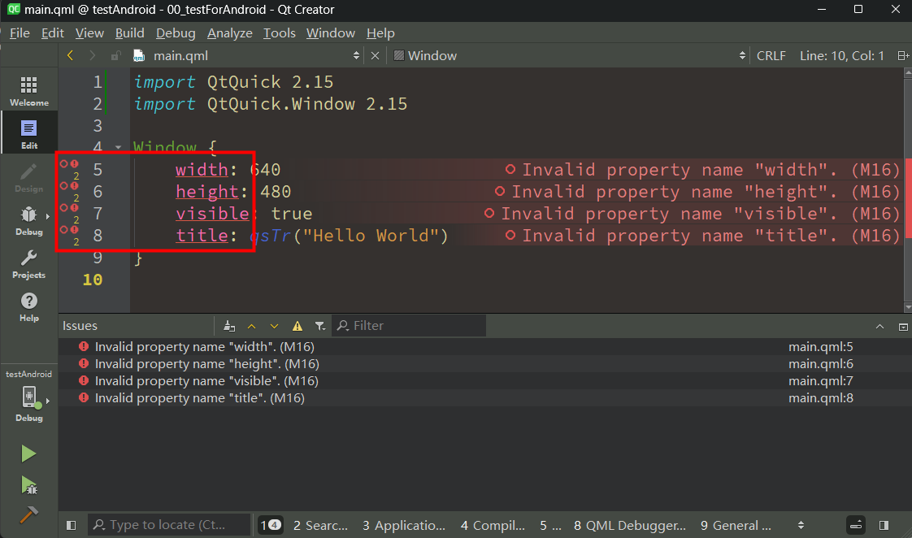
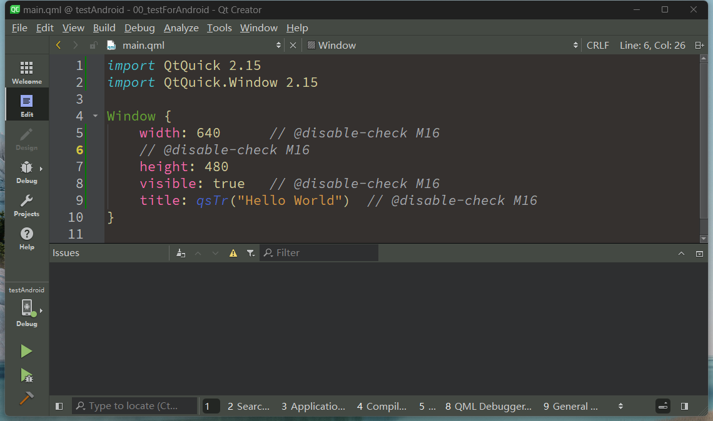
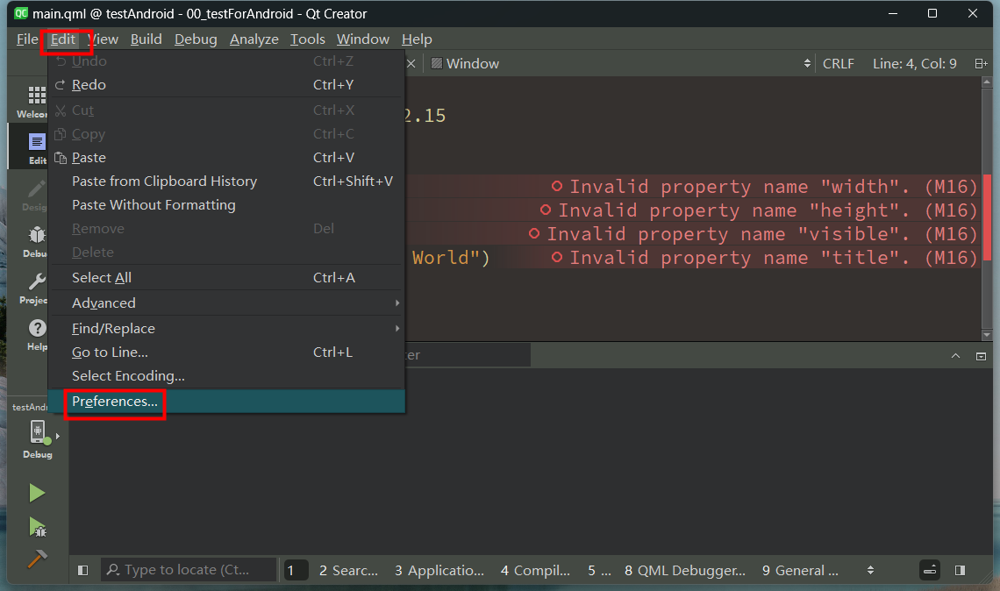
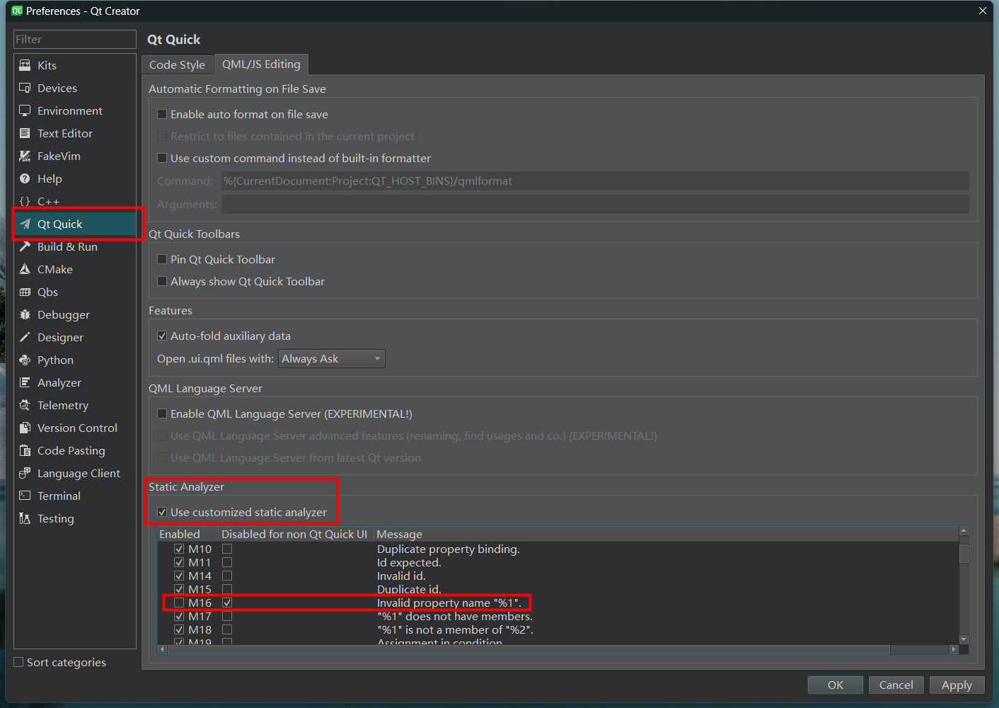
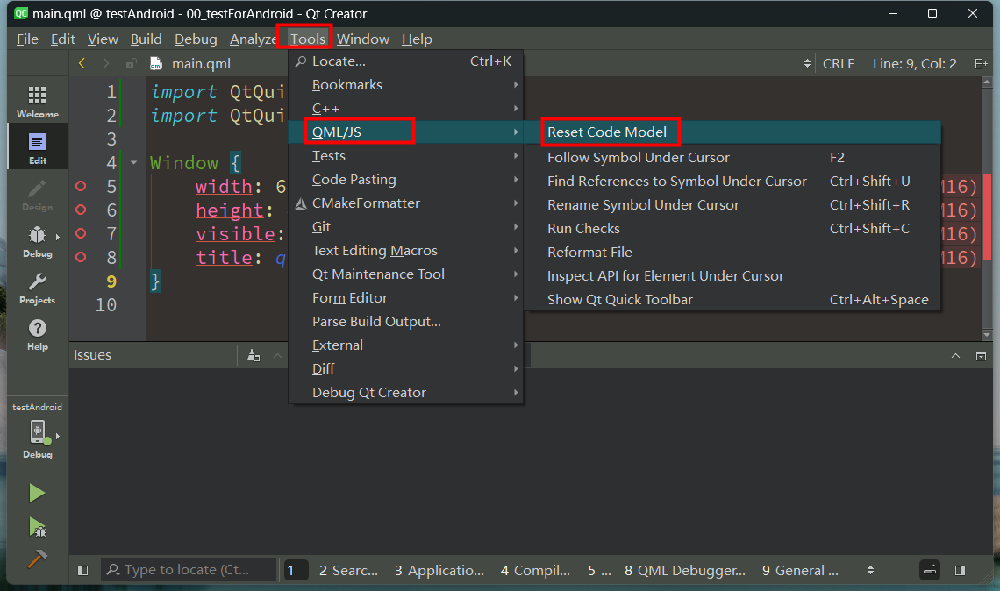
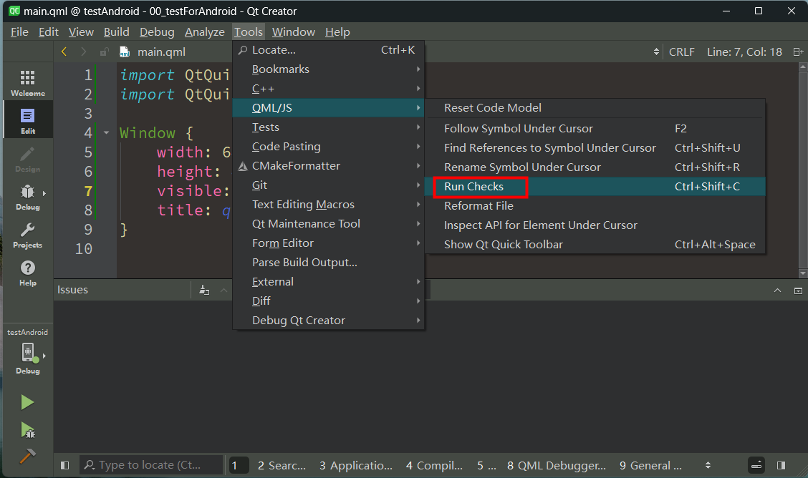
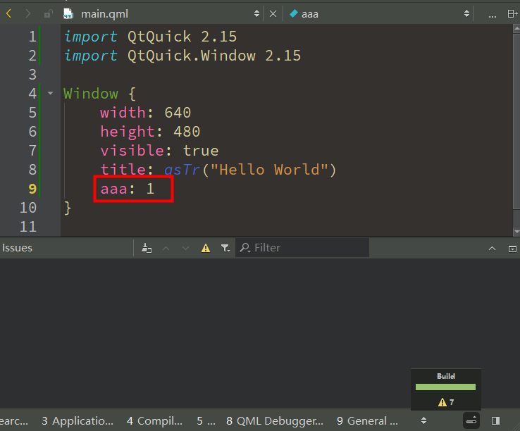

# About QML Project

## Separate QML files

**I want to Separate `my qml files` from `main.qml` in the same `qml.qrc` with different prefix.**
Just like this:

* step1: Create new project *test* and Add prefix *myQMLFiles*
 
* step2: Add new QML file to *qml.qrc Prefix: /myQMLFiles*(in new folder *testFile*)
 
* step3: in *`main.qml`*:
```js
import QtQuick 2.15
import QtQuick.Window 2.15

import "./testFile"

Window {
    width: 640
    height: 480
    visible: true
    title: qsTr("Hello World")

    MyRect {
        id: myRect_ID
    }
}
```
- in *`MyRect.qml`*:

```js
import QtQuick 2.15

Rectangle {
    color: "pink"
    width: 50
    height: 50
}
```
- in *`qml.qrc`*:
   

- The error appeared when you run, but you build it without error.
- **WHY**?
- That's the why:
- **`import "./testFile"`**
- must use qrc path!
- **`import "qrc:/myQMLFiles/testFile"`**

## 一次性解决所有Invalid property name(M16)

- 在QtCreator 中编辑qml文件时，由于某些模块导入的信息不完整，导致了一些让人烦恼的红色下划线，但是实际又是可以编译过和运行的。
- 
- 如果是少数情况可以直接在后面或者前面加上：
- `// @disable-check M16`
- 
- 如果大量出现，可以考虑直接禁用这个报错：
- 
- 
- 然后重新加载一下：
- 
- 
- 这样所有下划线就消失了；
- **注意：同样也会禁用掉真正没有的属性**：
- 
- 看个人选择；

> 参考：
>
> - [JavaScript and QML Checks | Qt Creator Manual](https://doc.qt.io/qtcreator/creator-reference-js-and-qml-error-codes.html)


## QML组件函数中动态创建其他qml文件组件

```js
//编辑图片
function onEditImageTriggered(patientId, studyId, imageExistedIds, imageSelectedIds)
{
    console.log("onEditImageTriggered")
    //动态创建组件
    if (imageEditWindow) {
        imageEditWindow.visible = false;
        imageEditWindow.destroy()
    }
    var imageEditComponent = Qt.createComponent("qrc:/ImageEdit/ImageEditWindow.qml")
    if (imageEditComponent.status === Component.Ready) {
        imageEditWindow = imageEditComponent.createObject(
            main_window, {
                "visible" : true
            })
    }
    if (imageEditComponent.status === Component.Error) {
        console.log("Error loading component: " + imageEditComponent.errorString())
    }
    imageEditWindow.updateWindow(patientId, studyId, imageExistedIds, imageSelectedIds)
}
```

